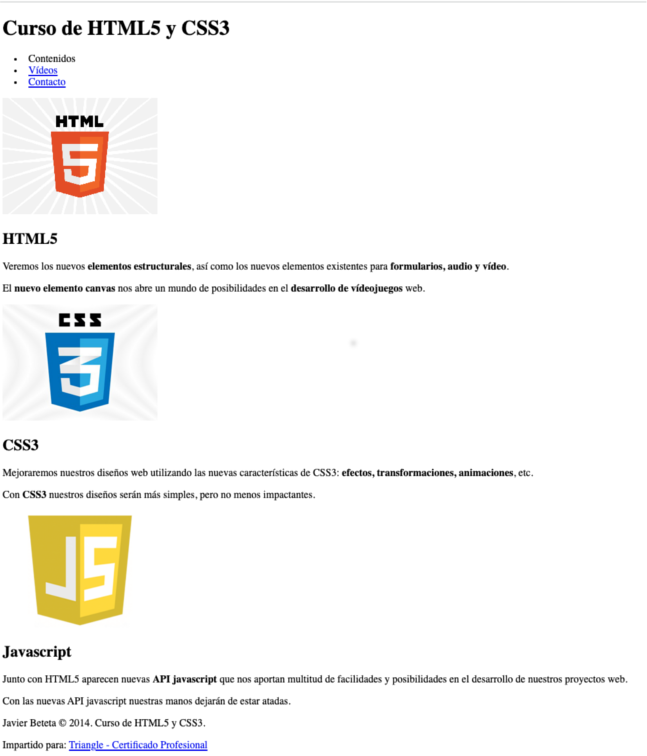
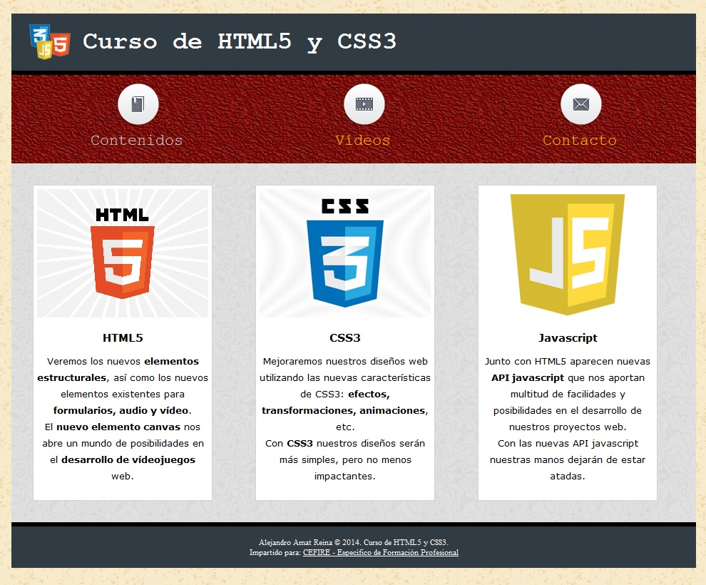

---
# Informació general del document
title: Práctica 2 - HTML5 CCS3 Introducción
author: Javier Beteta
date: 2022-01
subject: HTML5 CSS3
lang: es

# Portada
titlepage: true
titlepage-rule-height: 2
titlepage-rule-color: 653097
#titlepage-background: ../background/portadaASGBD.png
page-background: ../background/background3.pdf

# Taula de continguts
toc-own-page: true
toc-title: Contenidos

# Capçaleres i peus
header-left: App WEB
header-right: HTML5 CSS3
footer-left: Javier Beteta (Triangle)
footer-right: \thepage/\pageref{LastPage}

# Llistats de codi
listings-no-page-break: true
listings-disable-line-numbers: true

# Fitxer d'eixida


# Propietats de l'eixida (panrun)
output:
   to: pdf
   latex:
#     pdf-engine: xelatex
     from: markdown
#    template: eisvogel.latex
     listings: true
#     data-dir: /usr/share/mdfactory/
     number-sections: true
#   html:
#     highlight-style: haddock
#     number-sections: true
#     standalone: true
#     toc: true

header-includes:
   - \usepackage{lastpage}
---
# Crar una página web
En este segundo ejercicio, crearemos una página web como la que aparece en la siguiente imagen.



El ejercicio es guiado y se indica todos los pasos a seguir para obtener el resultado esperado. En cualquier caso, si tienes conocimientos previos suficientes de HTML y CSS, es muy recomendable que antes de resolver el ejercicio de forma guiada, intentes resolverlo por ti mismo sin consultar la guía que se expone a continuación.



Podéis encontrar todos los recursos necesarios en el fichero curso.zip del aula virtual. En este mismo fichero, encontraréis una imagen (resultado.jpg) en la que podéis observar cómo debe quedar el ejercicio.
La estructura de la página será prácticamente igual a la del ejercicio anterior (la podéis ver en el fichero index.html), tendremos un **\<div id="page"\>** que será el contenedor de toda la página, y dentro de este, tendremos los siguientes elementos:
- Un **\<div id="header"\>** que contendrá un **\<h1\>** con el título de la página.
- Un **\<div id="nav"\>** que contendrá una lista desordenada con los enlaces del menú de navegación.
- Un **\<div id="content"\>** que contendrá tres **\<div class="article"\>**.
- Cada **\<div class="article"\>** contendrá un **\<div class="article_header"\>** que, a su vez, contendrá una imagen y un **\<h2\>** con el título del artículo. El **\<div class="article"\>** también contendrá un par de párrafos de texto.
- Después del **\<div id="content"\>** tenemos un **\<div id="footer"\>** con el pie de página que contendrá un párrafo de texto.

Si visualizáis el fichero index.html en vuestro navegador, observaréis que la página no aparece como se muestra en la imagen. Esto es porque el fichero estilos.css de la carpeta css está vacío. Lo que tenéis que hacer en este ejercicio es completar los estilos necesarios para que la página se muestre como se espera.
A continuación, veremos los estilos que debemos crear:

- Utilizando el selector universal, configuraremos a 0px el margen interno y externo de todos los elementos.
- Elemento **\<body\>**:
  - Margen interno superior 20px.
  - Texto alineado al centro.
  - Imagen de fondo "../imgs/old_map.png". Para cambiar la imagen de fondo de un elemento, utilizaremos la propiedad background-image. Como el fichero de estilos está en la carpeta css y las imágenes en la carpeta imgs, tendremos que indicar la ruta relativa desde el lugar donde están los estilos hasta el lugar donde están las imágenes, en este caso "../imgs/old_map.png". Cuando indicamos la ruta de un recurso en un fichero de estilos, debemos utilizar la función url, por lo tanto, para cambiar la imagen de fondo, haremos lo siguiente: background-image: url("../imgs/old_map.png");
- Elemento page:
     - Tendrá un ancho de 960px.
     - Los márgenes superior e inferior serán de 0px, mientras que el izquierdo y derecho serán automáticos.
     - El texto estará alineado a la izquierda.
- Elemento header:
     - La fuente Courier de color blanco y tamaño 1.1em2.
     - El borde inferior tendrá 6px, será negro y de estilo sólido.
     - El color de fondo será #313B44.
- Si observamos la cabecera de la página, junto al título de la misma aparece la siguiente imagen:


Vemos que en el archivo index.html no tenemos ningún elemento **\**, así que, podemos deducir que esta imagen se encuentra en los estilos de la página. En general, cuando una imagen tiene más relación con el aspecto visual de la página que con los contenidos de la misma, la introduciremos siempre por medio de los estilos.
Veamos cómo debemos configurar los estilos del elemento **\<h1\>** para conseguir esta apariencia:

  - La imagen de fondo será "../imgs/logo.png".
  - Por defecto, cuando colocamos una imagen de fondo pequeña en un elemento más grande, la imagen se repetirá en mosaico hasta rellenar todo el elemento. Para controlar este comportamiento disponemos de la propiedad background-repeat. Como en este caso nos interesa que la imagen no se repita, asignaremos el valor no-repeat. (Para más información sobre esta propiedad, podéis consultar [background-repeat](http://www.w3schools.com/cssref/pr_background-repeat.asp).
  - Cuando una imagen de fondo no se repite, podemos indicar en qué posición queremos que aparezca utilizando la propiedad background-position. En este caso, nos interesa que aparezca desplazada 25px a la izquierda y centrada verticalmente, por lo tanto, indicaremos los siguientes valores: background-position: 25px center;. (Para más información sobre esta propiedad, podéis consultar [background-position](http://www.w3schools.com/cssref/pr_background-position.asp)
  - Si observamos la página en este momento, veremos que el texto del elemento **\<h1\>** se coloca sobre la imagen de fondo, lo cual, no es muy apropiado. Para solucionar este problema, le pondremos unos márgenes internos superior e inferior de 20px y unos márgenes internos izquierdo y derecho de 100px.
  
- Elemento nav:
     - La fuente será courier de tamaño 1.4em y color silver.
     - El texto estará alineado al centro.
     - La imagen de fondo será una textura que se repetirá hasta rellenar todo el elemento: "../imgs/red015.jpg".

- Veamos ahora como cambiaremos la lista de enlaces que se encuentra dentro del elemento nav para que tome el aspecto que nos interesa:
     - Para los elementos **\<li\>** de la lista desordenada tendremos una parte común para todos ellos y otra individual, ya que, cada opción de menú tiene una imagen distinta. Por este motivo, hemos puesto un id a cada uno de ellos. Veamos, en primer lugar, los estilos comunes que tienen los **\<li\>** que están dentro del *nav*:
          - Necesitamos tener espacio suficiente para que nos quepan las imágenes de cada uno de los enlaces, por lo tanto, le pondremos un margen interno superior de 80px.
          - Los márgenes externos los configuraremos de la siguiente forma: superior 0px, derecho 100px, inferior 20px e izquierdo 100px.
          - Eliminaremos el bullet o viñeta que coloca el navegador por defecto en las listas.
          - Los colocaremos en posición horizontal convirtiéndolos en elementos inline-block (display).
          - El texto estará centrado.
          - Colocaremos el cursor por defecto para que cuando situemos el ratón sobre el elemento sin enlace aparezca el cursor adecuado.

     - En cada uno de los elementos **\<li\>** debemos colocar la imagen adecuada, para ello, utilizaremos los identificadores de los mismos para seleccionarlos:
          - Elemento contenidos: Imagen "../imgs/book.png", eliminar repetición y posición centrada horizontalmente y a 10px del borde superior.
          - Elemento videos: Imagen "../imgs/film.png", eliminar repetición y posición centrada horizontalmente y a 10px del borde superior.
          - Elemento contacto: Imagen "../imgs/mail.png", eliminar repetición y posición centrada horizontalmente y a 10px del borde superior.
     - Para los enlaces:
          - Eliminaremos el subrayado.
          - Color de la fuente orange.
          - Color de la fuente cuando el ratón está sobre ellos white.
     - Elemento content:
          - Fuente verdana de tamaño 0.8em.
          - Imagen de fondo "../imgs/lgrey008.jpg".
     - Elementos de la clase article:
          - Ancho de 240px.
          - Borde de 1px color lightgray y estilo sólido.
          - Color de fondo white.
          - Texto alineado al centro.
          - Alto de línea de 1.8em (propiedad line-height).
          - Los márgenes internos los configuraremos de la siguiente forma: izquierdo, derecho y superior 5px, inferior 22px.
          - Los márgenes externos serán de 30px.
          - Los elementos de esta clase deben colocarse uno al lado del otro, por tanto, indicaremos que floten a la izquierda. Si observamos la página después de poner los elementos article flotantes, vemos que ha desaparecido la textura del elemento content. Es como si este elemento hubiera pasado a tener un alto de 0px. Esto ocurre porque, al contener sólo elementos flotantes, el elemento content piensa que está vacío. Anteriormente, para solucionar este problema, bastaba con poner los estilos *overflow: hidden;* y *height: 1%;* al elemento content. (Para más información podéis consultar el siguiente enlace [libros web, css avanzado](http://librosweb.es/css_avanzado/capitulo_1/limpiar_floats.html). Pero, al realizar algunas pruebas con Internet Explorer 11 me he encontrado con algunos problemas, así que vamos a utilizar la solución que se propone en la siguiente url: [clearing floats](http://www.sitepoint.com/clearing-floats-overview-different-clearfix-methods/). En concreto, lo que haremos será construir los estilos del elemento content de la siguiente forma:

          ```css
               .clearfix:before, .clearfix:after, #content {
               …
               width:100%;
               display: table;
          }
          ```
          Con esto, el limpiado de floats funcionará en todos los navegadores modernos.

     - Elementos de la clase *article_header*:
          - Borde inferior de 1px sólido y color *#999999*.

     - Elementos **\<h2\>**:
          - Márgenes internos 10px.
          - Tamaño de fuente 1.2em.
     - Elemento footer:
          - Deberá colocarse debajo de los elementos flotantes.
          - Fuente de color white y tamaño 0.7em.
          - Texto alineado al centro.
          - Color de fondo #313B44.
          - Borde superior de 6px color black y sólido.
          - Márgenes internos superior e inferior de 15px.
     - Enlaces que se encuentren dentro del elemento footer:
          - Color de fuente blanco.
  

Con esto habríamos terminado el ejercicio y debería visualizarse la página web tal y como aparece en la imagen.


