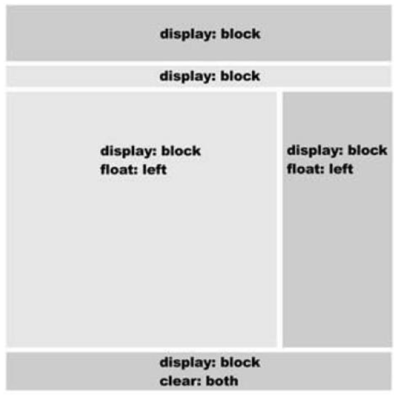
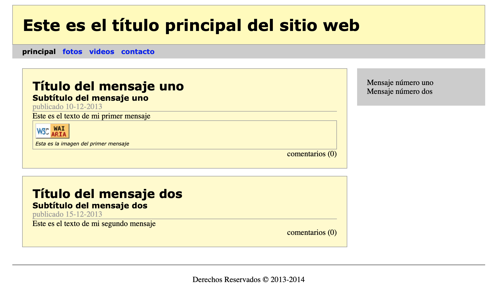

---
# Informació general del document
title: Práctica 1 - HTML5 Básico
author: Javier Beteta
date: 2022-01
subject: HTML5 CSS3
lang: es

# Portada
titlepage: true
titlepage-rule-height: 2
titlepage-rule-color: 653097
#titlepage-background: ../background/portadaASGBD.png
page-background: ../background/background3.pdf

# Taula de continguts
toc-own-page: true
toc-title: Contenidos

# Capçaleres i peus
header-left: App WEB
header-right: HTML5 CSS3
footer-left: Javier Beteta (Triangle)
footer-right: \thepage/\pageref{LastPage}

# Llistats de codi
listings-no-page-break: true
listings-disable-line-numbers: true

# Fitxer d'eixida


# Propietats de l'eixida (panrun)
output:
   to: pdf
   latex:
#     pdf-engine: xelatex
     from: markdown
#    template: eisvogel.latex
     listings: true
#     data-dir: /usr/share/mdfactory/
     number-sections: true
#   html:
#     highlight-style: haddock
#     number-sections: true
#     standalone: true
#     toc: true

header-includes:
   - \usepackage{lastpage}
---
# Creando la disposición de nuestra página con CSS

Con lo visto en clase sobre HTML5 y CSS3, vamos a crear un documento CSS que disponga los elmentos de nustra página, según la disposición típica de una web:



Vamos a partir del siguiente código inicial:

```html
<!doctype html>
<html lang="es">
<head>
    <meta charset="utf-8">
    <title>Blog</title>
    <meta name="description" content="HTML5 y CSS3">
    <meta name="author" content="Javier Beteta">
    <link rel="stylesheet" href="css/blogcss.css">
</head>

<body>
    <div id="page">
        <div id="header">
            <h1>Este es el título principal del sitio web</h1>
        </div>
        <div id="nav">
            <ul>
                <li>principal</li>
                <li><a href=”#”>fotos</a></li>
                <li><a href=”#”>videos</a></li>
                <li><a href=”#”>contacto</a></li>
            </ul>
        </div>
        <div id="content">
            <div class="article">
                <div class="article_header">
                    <h2>Título del mensaje uno</h2>
                    <h3>Subtítulo del mensaje uno</h3>
                    <p class="time">publicado 10-12-2013</p>
                </div>
                <p>Este es el texto de mi primer mensaje</p>
                <div class="figure">
                    
                    <p class="figcaption">Esta es la imagen del primer mensaje</p>
                </div>
                <div class="article_footer">
                    <p>comentarios (0)</p>
                </div>
            </div>
            <div class="article">
                <div class="article_header">
                    <h2>Título del mensaje dos</h2>
                    <h3>Subtítulo del mensaje dos</h3>
                    <p class="time">publicado 15-12-2013</p>
                </div>
                <p>Este es el texto de mi segundo mensaje</p>
                <div class="article_footer">
                    <p>comentarios (0)</p>
                </div>
            </div>
        </div>
        <div id="aside">
            <blockquote>Mensaje número uno</blockquote>
            <blockquote>Mensaje nú  mero dos</blockquote>
        </div>
        <div id="footer">
            <p>Derechos Reservados &copy; 2013-2014</p>
        </div>
    </div>
</body>

</html>
```
# Formatear el código HTML mediante CSS

Primero crearemos el fichero css **blogcss.css** en la carpeta *css* tal y como se indica en la etiqueta **\<link\>**.

## Estilos y estructura

A pesar de que cada navegador garantiza estilos por defecto para cada uno de los elementos HTML, estos estilos no necesariamente satisfacen los requerimientos de cada diseñador. Por lo tanto, los diseñadores y desarrolladores deben aplicar sus propios estilos para obtener la organización y el efecto visual que realmente desean.
Con respecto a la estructura, básicamente, cada navegador ordena los elementos por defecto de acuerdo a su tipo: block (bloque) o inline (en línea). Como hemos comentado anteriormente, esta clasificación está asociada con la forma en que los elementos son mostrados en pantalla. Los elementos block son posicionados uno sobre otro hacia abajo en la página, mientras que, los elementos inline son posicionados, uno al lado del otro en la misma línea, sin ningún salto de línea, a menos que ya no haya más espacio horizontal para ubicarlos.
La página web de ejemplo está basada en el diseño web típico anterior, el cual incluía barras horizontales y dos columnas en el medio. Debido a la forma en que los navegadores muestran estos elementos por defecto, el resultado en la pantalla está muy lejos de nuestras expectativas. En concreto, la posición de las dos columnas definidas por los elementos content y aside es errónea. Una columna está debajo de la otra, en lugar de estar a su lado como correspondería. Cada bloque se muestra, por defecto, tan ancho como sea posible, tan alto como la información que contiene y uno sobre otro.

## Modelos de caja

Para aprender cómo podemos crear nuestra propia organización de los elementos en pantalla, primero debemos entender cómo los navegadores procesan el código HTML.

Los navegadores consideran cada elemento HTML como una caja. Una página web es en realidad un grupo de cajas ordenadas siguiendo ciertas reglas. Estas reglas se establecen por los estilos por defecto que aplican los navegadores a cada elemento de la página, o por los estilos que aplican los diseñadores mediante CSS.
Combinando las propiedades CSS en los elementos de la página podemos obtener la organización deseada. Estas propiedades, tienen que ser combinadas para formar reglas que luego serán usadas para obtener la correcta disposición en pantalla. A la combinación de estas reglas la llamaremos disposición de la página (Layout). Todas estas reglas aplicadas juntas, constituyen lo que se llama un modelo de caja.

Gracias a las etiquetas **\<div\>** y a los estilos CSS fue posible reemplazar la maquetación mediante tablas y separar la estructura HTML de la presentación. Con elementos **\<div\>** y CSS, podemos crear cajas en la pantalla, posicionar estas cajas a un lado o a otro y darles un tamaño, color o borde específico entre otras características.

CSS dispone de propiedades específicas que nos permiten organizar las cajas. Estas propiedades son lo suficientemente poderosas como para crear un modelo de caja que se conoce como Modelo de Caja Tradicional.

A continuación, aplicaremos los estilos necesarios a nuestro diseño básico para que adopte la forma que nos interesa.

## Creando la disposición de nuestra página con CSS

### Márgenes por defecto

```css
    * { margin: 0px; padding: 0px; }
```

Utilizando el selector universal establecemos en 0px los márgenes por defecto de todos los elementos de nuestra página. De esta forma, sólo necesitaremos modificar los márgenes de los elementos que queremos que sean mayores que cero.

Es importante recordar que en HTML cada elemento es considerado como una caja. El *margin* es en realidad el espacio alrededor del elemento, el que se encuentra por fuera del borde de esa caja. El estilo padding, por otro lado, es el espacio alrededor del contenido del elemento, pero dentro de sus bordes.

El tamaño del margen puede ser definido por lados específicos del elemento o todos sus lados a la vez. El estilo *margin: 0px* en nuestro ejemplo, establece un margen 0 o nulo para cada elemento de la caja. Si el tamaño hubiese sido especificado en 5 píxeles, por ejemplo, la caja tendría un espacio de 5 píxeles de ancho en todo su contorno. Esto significa que la caja estaría separada de sus vecinas por 5 píxeles.

```css
    h1 { font: bold 2em verdana, sans-serif; }
    h2 { font: bold 1.5em verdana, sans-serif; }
    h3 { font: bold 1em verdana, sans-serif; }
```

### Centrando el cuerto

Centrando el cuerpo
El primer elemento que forma parte del modelo de caja es siempre **\<body\>**. Normalmente, por diferentes razones de diseño, el contenido de este elemento debe ser posicionado horizontalmente. Siempre deberemos especificar el tamaño de este contenido, o un tamaño máximo, para obtener un diseño consistente a través de diferentes configuraciones de pantalla.

```css
    body { text-align: center; }
```

Por defecto, la etiqueta **\<body\>** (como cualquier otro elemento block) tiene un valor de ancho establecido en 100%. Esto significa que el cuerpo ocupará el ancho completo de la ventana del navegador.

### Creando caja principal

Siguiendo con el diseño de nuestra plantilla, debemos especificar una tamaño o tamaño máximo para el contenido del cuerpo. En nuestro documento básico agregamos un elemento **\<div id="page"\>** para agrupar todas las cajas dentro del cuerpo. Este **\<div\>** será la caja principal para la construcción de nuestro modelo de caja. De este modo, modificando el tamaño de este elemento lo hacemos al mismo tiempo para todos los demás:

```css
    #page { width: 960px; margin: 15px auto; text-align: left; }
```

Esta regla aplica tres estilos a la caja principal:

- El primer estilo establece un valor fijo de 960 píxeles para el ancho de la caja.
  
- El segundo estilo es parte de lo que llamamos el Modelo de Caja Tradicional. En la regla anterior, especificamos que el contenido del cuerpo sería centrado horizontalmente con el estilo text-align: center. Pero esto sólo afecta al contenido inline, como textos o imágenes. Para elementos block, como un **\<div\>**, necesitamos establecer un valor específico para sus márgenes que los adapta automáticamente al tamaño de su elemento padre. La propiedad margin usada para este propósito puede tener cuatro valores: superior, derecho, inferior, izquierdo, en este orden. Esto significa que el primer valor declarado en el estilo representa el margen de la parte superior del elemento, el segundo es el margen de la derecha, y así sucesivamente. Sin embargo, si sólo escribimos los primeros dos parámetros, el resto tomará los mismos valores. En nuestro ejemplo, estamos usando esta técnica. El estilo margin: 15px auto asigna 15 píxeles al margen superior e inferior del elemento **\<div\>** que está afectando, y declara como automático el tamaño de los márgenes de izquierda y derecha. De esta manera, habremos generado un espacio de 15 píxeles en la parte superior e inferior del cuerpo y los espacios a los laterales (margen izquierdo y derecho) serán calculados automáticamente de acuerdo al tamaño del cuerpo del documento y el elemento **\<div\>**, centrando el contenido en pantalla.
- El último estilo (text-align: left) lo necesitamos para prevenir un problema que ocurre en algunos navegadores. La propiedad text-align es hereditaria. Esto significa que todos los elementos dentro del cuerpo y su contenido serán centrados, no solo la caja principal. El estilo asignado a **\<body\>** será asignado a cada uno de sus hijos. Debemos retornar este estilo a su valor por defecto para el resto del documento. El resultado final es que el contenido del cuerpo está centrado, pero el contenido de la caja principal estará alineado nuevamente a la izquierda, por lo tanto, todo el resto del código HTML dentro de esta caja hereda este estilo.

### la cabacera

tenemos el **\<div id="header"\>**. Este elemento contiene el título principal de nuestra página web y estará ubicado en la parte superior de la pantalla. Como ya mencionamos, cada elemento block, así como el cuerpo, por defecto tiene un valor de ancho del 100%. Esto significa que el elemento ocupará todo el espacio horizontal disponible. En el caso del cuerpo, ese espacio es el ancho total de la pantalla visible (la ventana del navegador), pero en el resto de los elementos el espacio máximo disponible estará determinado por el ancho de su elemento padre. En nuestro ejemplo, el espacio máximo disponible para los elementos dentro de la caja principal será de 960 píxeles, porque su padre es la caja principal que fue previamente configurada con este tamaño. Por lo tanto, lo único que haremos será asignar estilos que nos permitirán reconocer el elemento cuando es presentado en pantalla.
```css
    #header { background: #FFFBB9; border: 1px solid #999999; padding: 20px; }
```
En esta regla le otorgamos al **\<div id="header"\>** un fondo amarillo, un borde sólido de 1 píxel y un margen interior de 20 píxeles.

### Barra de navegación

Siguiendo al elemento **\<div id="header"\>** se encuentra el elemento **\<div id="nav"\>**, el cual tiene el propósito de proporcionar ayuda para la navegación. Los enlaces agrupados dentro de este elemento representarán el menú de nuestro sitio web. Este menú será una simple barra ubicada debajo de la cabecera. Por lo tanto, lo único que nos queda por hacer es mejorar su aspecto en pantalla. Agregaremos un fondo gris y un pequeño margen interno para separar las opciones del menú del borde del elemento:

```css
    #nav { background: #CCCCCC; padding: 5px 15px; }
    #nav li { display: inline; list-style: none; padding: 5px; 
            font: bold 14px verdana, sans-serif; cursor:default;}
```
Dentro de la barra de navegación hay una lista desordenada. Por defecto, los ítems de una lista son posicionados unos sobre otros. Para cambiar este comportamiento y colocar cada opción del menú una al lado de la otra, referenciamos los elementos **\<li\>** dentro de este elemento **\<div id="nav"\>** usando el selector #nav li, y luego asignamos a todos ellos el estilo display: inline para convertirlos en elementos inline. A diferencia de los elementos block, los elementos afectados por el parámetro inline no generan ningún salto de línea.

En esta última regla, también eliminamos el pequeño gráfico generado por defecto por los navegadores delante de cada opción del listado utilizando la propiedad list-style.
En cada elemento de la lista aparece un enlace que nos llevará a otra sección de la página, pero en la sección actual no existe enlace, esto hace que al colocar el ratón sobre el elemento de menú de la sección actual aparezca un cursor inadecuado. Para solucionar esto, utilizamos la propiedad cursor: default, que hará que en los elementos **\<li\>** aparezca siempre el cursor default.
Sólo nos queda mejorar un poco el aspecto de los enlaces del menú:

```css
    #nav a { text-decoration:none; }
    #nav a:hover { color: white; }
```

Por defecto, los enlaces aparecen subrayados, con el estilo *text-decoration:none* eliminamos el subrayado de los mismos. Además, utilizamos la pseudoclase *a:hover* para cambiar el estilo de los enlaces cuando el ratón está sobre ellos. En este caso, cambiamos el color de la fuente a blanco color: white.

### Sección principal de contenidos y barra lateral

Los siguientes elementos estructurales en nuestro ejemplo son dos cajas que nos interesa que se dispongan horizontalmente. El Modelo de Caja Tradicional es construido sobre estilos CSS que nos permiten especificar la posición de cada caja. Usando la propiedad float podemos posicionar estas cajas del lado izquierdo o derecho de acuerdo a nuestras necesidades. Los elementos que utilizamos para crear estas cajas son **\<div id="content"\>** y **\<div id="aside"\>**.

```css
#content { float: left; width: 660px; margin: 20px; }
#aside { float: left; width: 220px; margin: 20px 0px; padding: 20px; background: #CCCCCC; }
```

La propiedad de CSS float es una de las propiedades más ampliamente utilizadas para aplicar el Modelo de Caja Tradicional. Hace que el elemento flote hacia un lado o al otro en el espacio disponible. Los elementos afectados por float actúan como elementos block (con la diferencia de que son ubicados de acuerdo al valor de esta propiedad y no el flujo normal del documento). Los elementos son movidos a izquierda o derecha en el área disponible, tanto como sea posible, respondiendo al valor de float.
Con las reglas anteriores, declaramos la posición de ambas cajas y sus respectivos tamaños, generando así las columnas visibles en la pantalla. La propiedad float mueve la caja al espacio disponible del lado especificado por su valor, width asigna un tamaño horizontal y margin, por supuesto, declara el margen del elemento.
Afectado por estos valores, el contenido del elemento **\<div id="content"\>** estará situado a la izquierda de la pantalla con un tamaño de 660 píxeles, más 40 píxeles de margen, ocupando un espacio total de 700 píxeles de ancho.
La propiedad float del elemento **\<div id="aside"\>** también tiene el valor left (izquierda). Esto significa que la caja generada será movida al espacio disponible a su izquierda. Debido a que la caja previa creada por el elemento **\<div id="content"\>** fue también movida a la izquierda de la pantalla, ahora el espacio disponible será solo el que esta caja deja libre. La nueva caja quedará ubicada en la misma línea que la primera, pero a su derecha, ocupando el espacio restante en la línea, creando así la segunda columna de nuestro diseño.
El tamaño declarado para esta segunda caja fue de 220 píxeles. También agregamos un fondo gris y configuramos un margen interno de 20 píxeles. Como resultado final, el ancho de esta caja será de 220 píxeles más 40 píxeles agregados por la propiedad padding (los márgenes de los lados fueron declarados a 0px).
Es importante que tengamos en cuenta que el tamaño de un elemento y sus márgenes se suman para obtener el valor real ocupado en pantalla. Si tenemos un elemento de 200 píxeles de ancho y un margen de 10 píxeles a cada lado, el área real ocupada por el elemento será de 220 píxeles.
Lo mismo pasa con las propiedades padding y border. Cada vez que agregamos un borde a un elemento o creamos un espacio entre el contenido y el borde usando padding, esos valores se sumarán al ancho del elemento para obtener el valor real cuando el elemento es mostrado en pantalla.
El tamaño real de un elemento se calculará con la fórmula: tamaño + márgenes + márgenes internos + bordes.

### Pie de página

Para finalizar la aplicación del Modelo de Caja Tradicional, tenemos que aplicar otra propiedad CSS al elemento **\<div id="footer"\>**. Esta propiedad devuelve al documento su flujo normal y nos permite posicionar este elemento debajo del anterior, en lugar de a su lado.
```css
    #footer { clear: both; text-align: center; padding: 20px; 
            border-top: 2px solid #999999; }
```
La regla anterior declara un borde de 2 píxeles en la parte superior del elemento **\<div id="footer"\>**, un margen interno (padding) de 20 píxeles, y centra el texto dentro del elemento. Así mismo, restaura el flujo normal del documento con la propiedad clear. Esta propiedad, simplemente, restaura las condiciones normales del área ocupada por el elemento, no permitiéndole posicionarse adyacente a una caja flotante. El valor usualmente utilizado es both, que significa que ambos lados del elemento serán restaurados y el elemento seguirá el flujo normal (este elemento ya no es flotante como los anteriores). Esto, para un elemento block, quiere decir que será posicionado debajo del último elemento, en una nueva línea.
La propiedad clear también empuja los elementos verticalmente, haciendo que las cajas flotantes ocupen un área real en la pantalla. Sin esta propiedad, el navegador presenta el documento en pantalla como si los elementos flotantes no existieran y las cajas se superponen.
Cuando tenemos cajas posicionadas una al lado de la otra en el Modelo de Caja Tradicional siempre necesitamos crear un elemento con el estilo clear: both para poder seguir agregando otras cajas debajo de un modo natural. La imagen anterior muestra una representación visual de este modelo con los estilos básicos para lograr la correcta disposición en pantalla.
Los valores left (izquierda) y right (derecha) de la propiedad float no significan que las cajas deben estar necesariamente posicionadas del lado izquierdo o derecho de la ventana. Lo que los valores hacen es volver flotante ese lado del elemento, rompiendo el flujo normal del documento. Si el valor es left, por ejemplo, el navegador tratará de posicionar el elemento del lado izquierdo en el espacio disponible. Si hay espacio disponible a continuación de otro elemento, este nuevo elemento será situado a su derecha, porque su lado izquierdo fue configurado como flotante. El elemento flota hacia la izquierda hasta que encuentra algo que lo bloquea, como otro elemento o el borde de su elemento padre. Esto es importante cuando queremos crear varias columnas en la pantalla. En este caso cada columna tendrá el valor left en la propiedad float para asegurar que cada columna estará contigua a la otra en el orden correcto. De este modo, cada columna flotará hacia la izquierda hasta que es bloqueada por otra columna o el borde del elemento padre.

### Últimos toques

Lo ánico que nos queda por hacer es trabajar en el diseño del contenido.

```css
    .article { background: #FFFBCC; border: 1px solid #999999; 
        padding: 20px; margin-bottom: 15px; }
    .article_header { border-bottom: 1px solid #999999; }
    .article_footer { text-align: right; }
    .time { color: #999999; }
    .figure { border: 1px double #999999; padding: 5px; }
    .figure .figcaption { font: italic 0.6em verdana, sans-serif; }
```

La primera regla referencia los elementos de la clase article y les otorga algunos estilos básicos (color de fondo, un borde sólido de 1 píxel, margen interno y margen inferior). El margen inferior de 15 píxeles tiene el propósito de separar un elemento article del siguiente verticalmente.
Cada elemento article cuenta con un elemento article_header, que muestra los títulos y fecha de publicación del artículo, y un elemento *article_footer*, que muestra los comentarios recibidos. El texto de los elementos *article_footer* aparecerá alineado a la derecha, mientras que los elementos article_header tendrán un borde inferior.
Los elementos time tendrán el color de la fuente *#999999*.
En el primer artículo, además, tenemos un elemento **\<div class="figure"\>** que contiene una imagen y un elemento **\<div class="figcaption"\>** que nos muestra un texto explicativo de la misma. Por lo tanto, crearemos dos reglas para aplicar estilos a dichos elementos. En concreto, se pondrá un borde a los elementos figure y se cambiará la fuente a los elementos figcaption.

## Resultado

El resultado final de la página debe ser el siguiente:




## Práctica

Crea tú la página HTML y el CSS siguiendo las instrucciones del documento para conseguir que se vea la página como la imagen anterior.


