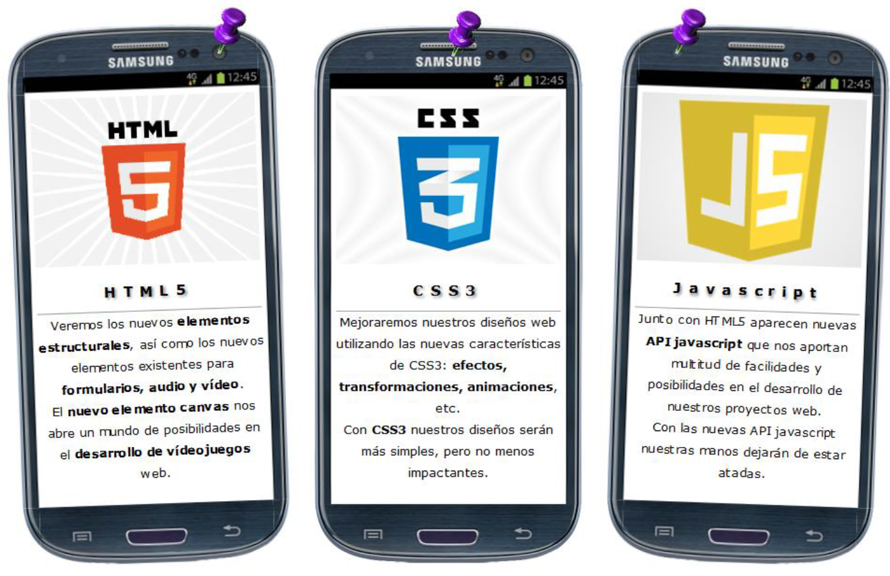
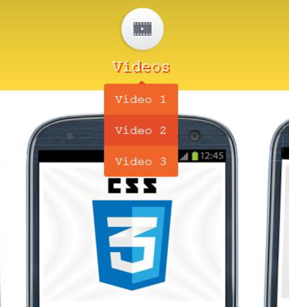
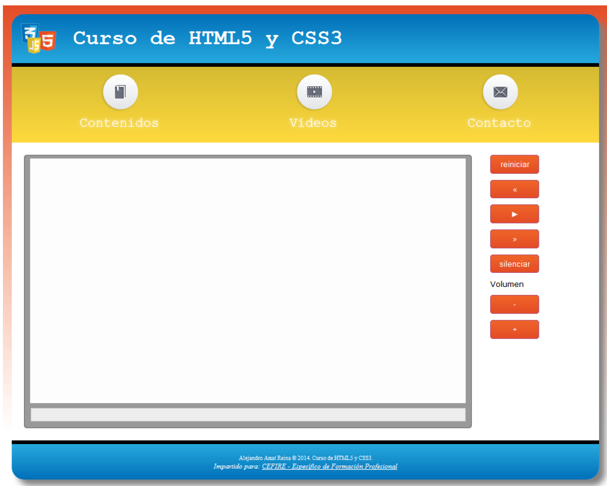

---
# Informació general del document
title: Práctica T03 - Multimedia, Transformacione y Transiciones
author: Javier Beteta
date: 2022-01
subject: HTML5 CSS3 Multimedia, Transformaciones y transiciones
lang: es

# Portada
titlepage: true
titlepage-rule-height: 2
titlepage-rule-color: 653097
#titlepage-background: ../background/portadaASGBD.png
page-background: ../background/background3.pdf

# Taula de continguts
toc-own-page: true
toc-title: Contenidos

# Capçaleres i peus
header-left: App WEB
header-right: Práctica 03
footer-left: Javier Beteta (Triangle)
footer-right: \thepage/\pageref{LastPage}

# Llistats de codi
listings-no-page-break: true
listings-disable-line-numbers: true

# Fitxer d'eixida


# Propietats de l'eixida (panrun)
output:
   to: pdf
   latex:
#     pdf-engine: xelatex
     from: markdown
#    template: eisvogel.latex
     listings: true
#     data-dir: /usr/share/mdfactory/
     number-sections: true
#   html:
#     highlight-style: haddock
#     number-sections: true
#     standalone: true
#     toc: true

header-includes:
   - \usepackage{lastpage}
---
# Introducción

## Multimedia en HTML5

Hoy en día es de lo más común descargar y ver vídeo dentro del navegador web. Conforme el ancho de banda comenzó a hacerse realmente ancho, la popularización del video a través de una conexión de datos se hizo posible; la información dejó de ser sólo texto e imágenes pequeñas o ultra comprimidas y la web se tornó realmente multimedia.

HTML5 introdujo un elemento para insertar y reproducir vídeo en un documento HTML. El elemento **<video>** usa etiquetas de apertura y cierre, además, sólo necesita unos pocos parámetros para lograr su función. La sintaxis es extremadamente sencilla y sólo el atributo src es obligatorio:

```html
     <video src="video.mp4" controls></video>
```
El código anterior debería ser suficiente, pero, como explicamos anteriormente, las cosas se vuelven un poco más complicadas en la vida real.

### Contenedores
Como se mencionó antes, un contenedor define el formato y contiene las pistas de vídeo y audio. Los contenedores soportados por HTML5 son los siguientes:

- MP4 (m-peg4 Part 14)(extension *.mp4*)
- OGG: estándar abierto está soportado por HTML5 (extensión *.ogv*)
- WebM: apoyada por Google. extensión *.webm*

### Códecs de vídeo para HTML5
Los siguientes codecs de vádeo son válidos en HTML5, aunque no todos ellos son soportados por cada uno de los principales navegadores.

- h.264 (MPEG-4 PArt 10 o MPEG-4 AVC). Uno de los formatos más utilizados actualmente.

### Códecs de audio para HTML5
Los siguientes codecs de audio son válidos en HTML5, aunque, como ocurre con los codecs de vídeo, no todos ellos son soportados por todos los navegadores.

- AAC (Advanced Audio Coding), utilizado como pista de audio en un vídeo en conjunto con el códec H.264 en un contenedor MP4.
- Vobis, Vorbis es un códec de estándar libre que se utiliza comúnmente para codificar sonido dentro de vídeos de formato OGG y WebM
- MP3 (MPEG-1 Audio Layer 3), el estándar de codificación de audio MP3 es uno de los más populares. Este códec puede ser utilizado también en conjunto con el H.264 en un contenedor MP4.
  
### Soporte e formato y codecs por parte de los navegadores


Es importante hacer notar que no existe una sola combinación formato/códec de vídeo/códec de audio, a la cual, todos los navegadores modernos le den soporte, por este motivo, es necesario realizar la codificación en varios formatos.

## El elemento vídeo

El elemento **<video>** ofrece varios atributos para establecer su comportamiento y configuración:

- atributos *width* y *height*: declaran las dimensiones para el elemento o ventana del reproductor. El tamaño del vídeo será automáticamente ajustado para entrar dentro de estos valores, pero no fueron considerados para redimensionar el vídeo, sino para limitar el área ocupada por el mismo.
  
- El atributo *src* indca la fuente del vídeo.
     ```html
          <video id="medio" width="720" height="400" controls>
               <source src="video.mp4">
               <source src="video.ogg">
          </video>
     ```
- *controls*: este atributo muestra controles de vídeo provistos por el navegador.

Junto con *controls* también podemos utilizar:

- *autoplay*: comenzará la reproducción automática
- *loop*: reproduce en bucle
- *poster*: imaegen que se muestra mientras se carga el vídeo
- *preload*: Puede tomar tres valores:
 - *none*: vídeo no debe ser cacheado.
 - *metadata*: recomienda al navegador que trate e capturar información acerca del vídeo (dimensiones, duración etc..)
 - *auto*: descargar el archivo tan pronto como sea posible
  
  ```html
     <video id="reproductor" width="720" height="400" preload controls loop poster="poster.jpg">
          <source src="video.mp4">
          <source src="video.ogg">
     </video>
  ```

## Reproducir audio en HTML5

HTML5 provee un nuevo elemento para reproducir audio en un documento HTML. El elemento, por supuesto, es **<audio>** y comparte casi las mismas características del elemento **<video>**.

```html
     <audio id="medio" controls>
          <source src="cancion.mp3">
          <source src="cancion.ogg">
     </audio>
```
El código anterior reproducirá música en todos los navegadores utilizando los controles por defecto. Aquellos que no puedan reproducir MP3 reproducirán OGG y viceversa.

## Tipos mime

Los tipos MIME (Internet Media Types) son una forma de definir formatos de archivos para que nuestro sistema sepa cómo manejarlos. Estos tipos los podemos manejar a dos niveles:

```html
     <audio>
          <source src="elvis.mp3" type='audio/mpeg; codecs="mp3"'>
          <source src="elvis.ogg" type='audio/ogg; codecs="vorbis"'>
     </audio>
     <video poster="star.png" autoplay loop controls tabindex="0">
          <source src="movie.webm" type='video/webm; codecs="vp8, vorbis"' />
          <source src="movie.ogv" type='video/ogg; codecs="theora, vorbis"' />
     </video>
```

## Controlar la reproducción de audio y vídeo mediante javascript

HTML5 incorpora una lista de métodos para procesamiento de medios. Los siguientes son los más relevantes:
- play(): comienza a reproducir el medio desde el inicio, a menos que el medio haya sido pausado previamente.
- pause(): pausa la reproducción.
- load(): carga el archivo del medio. Es útil en aplicaciones dinámicas para cargar el medio anticipadamente.
- canPlayType(formato): Con este método podemos saber si el formato del archivo se soporta por el navegador o no.

```html
     <video id="video" width="720" height="400">
          <source src="video.mp4">
          <source src="video.ogg">
     </video>
     <div>
          <input type="button" id="boton" value="Reproducir">
     </div>
     <script>
          function iniciar() {
               var boton=document.getElementById('boton');
               boton.addEventListener('click', presionar, false);
          }
          function presionar() {
               var video=document.getElementById('video');
               video.play();
          }
          window.addEventListener('load', iniciar, false);
     </script>
```
# Practica
## Ejercicio 1

Lo que tenemos que hacer en este ejercicio es eliminar la imagen del logo de la cabecera de nuestra hoja de estilos e introducirla mediante HTML. Para ello introduciremos un nuevo elemento **** dentro del elemento **<h1>** de nuestro **<header>**.
El aspecto de la página debe continuar igual que cuando teníamos la imagen dentro del CSS, por lo que tendremos que aplicar los estilos que sean necesarios. En concreto, pondremos el elemento **<h1>** que contendrá el **** con posicionamiento relativo y el elemento **** con posicionamiento absoluto y posición izquierda y superior a 15px.

## Ejercicio 2
En ocasiones, para conseguir un diseño específico no tenemos más remedio que introducir un elemento que no tendrña semántica ni aportará nada a los contenidos, pero que nos ayudará como elemento contenedor para, por ejemplo, poner una imagen de fondo y ubicarla en el lugar que nos interese. En estos casos, utilizaremos siempre elementos **<div>** o **<span>**, dependiendo de si necesitamos un elemento en bloque o en línea.
El resultado que queremos obtener en este ejercicio es el siguiente:



La imagen de la chincheta se encuentra en la carpeta recursos. Para colocar esta imagen sobre la cabecera de nuestros móviles, necesitaremos introducir un elemento **<div>** en cada uno de los **<header>** de nuestros elementos **<article>**.

```html
<div class="chincheta"></div>
```

Una vez modificado el *html* tendremos que colocar la chincheta en el lugar adecuado, para lo cual, le pondremos posición absoluta (evidentemente, los elementos **<header>** de los **<article>** tendrán posición relativa).
Los elementos chincheta tendrán las siguientes propiedades: ancho 35px, alto 49px, posición superior -91px, imagen de fondo chincheta.png. Además, habrá que controlar la superposición con los móviles.
La chincheta del primer **<article>** tendrá la posición izquierda en 199px, la del segundo en 120px y la del tercero en 30px.
Para evitar que las chinchetas se solapen con la barra de navegación, le pondremos un margen superior a los **<article>** de 30px.
Una vez hemos colocado las chinchetas, para que parezca que los móviles están colgando de ellas, rotaremos un poco los **<article>** primero y tercero. Para ello utilizaremos una transformación de rotación de -2deg en el primero y 2deg en el tercero.

## Ejercicio 3

En este ejercicio vamos a aplicar un efecto sobre los enlaces de la barra de navegación, de forma que al colocar el cursor sobre ellos se produzca una transición que cambie su aspecto.
En primer lugar, le aplicaremos al texto de estos enlaces una sombra con las siguientes características: distancia horizontal y vertical 0px, radio de difuminación 5px y color blanco. El enlace quedará así:


A continuación, indicaremos que al poner el ratón sobre el enlace se aplique una sombra con las siguientes características: distancia horizontal y vertical 2px, radio de difuminación 0px y color rojo. El enlace con el ratón sobre él quedará así:


Finalmente, indicaremos que la transición de una sombra a la otra tarde 0.5 segundos.

## Ejercicio 4

En este ejercicio, vamos a reproducir el ejemplo práctico que se ha presentado en el último punto del tema (El menú desplegable).
Crearemos un menú desplegable que se mostrará cuando coloquemos el ratón en la opción de menú vídeos. El menú contendrá tres opciones: vídeos1, vídeos2 y vídeos3. Estas tres opciones, así como el enlace principal a vídeos, enlazarán con el documento videos.html que crearemos en el siguiente ejercicio.
Los colores del menú que debes utilizar son los siguientes:

```css
     #page>nav li ul li { background-color:#e34c26; }
     #page>nav li ul li:nth-child(odd) { background-color:#f06529; }
     #page>nav li ul li:hover { background-color:#ff7e42; }
```

El color de borde de la regla:

```css
      #page>nav li ul li:first-child:before
```
será , será *#e34c26*.

La página con el menú desplegado se verá de la siguiente forma:



## Ejercicio 5

En este último ejercicio vamos a crear una nueva sección dentro de nuestra página web, en concreto, la sección de vídeos. Accederemos a esta sección a través de los enlaces del menú desplegable creado en el ejercicio anterior y de la opción principal vídeos.
Esta sección la crearemos dentro de un documento llamado *videos.html*. Este documento será exactamente igual que el documento index.html, salvo dos excepciones:

- En el menú de navegación, el enlace de contenidos apuntará a la página *index.html*.
- Los contenidos del documento (elemento **<main>**) serán diferentes a los del documento *index.html* y se explicarán a continuación.



El código de nuestra sección **<main>**, será el siguiente:

```html
<main>
     <div id="reproductor">
          <video id="medio" width="720" height="400">
               <source src="media/trailer.mp4">
               <source src="media/trailer.ogg">
          </video>
          <div id="barra">
               <div id="progreso"></div>
          </div>
     </div>
     <nav>
          <input type="button" id="reiniciar" value="reiniciar">
          <input type="button" id="retrasar" value="&laquo;">
          <input type="button" id="play" value="&#9658;">
          <input type="button" id="adelantar" value="&raquo;">
          <input type="button" id="silenciar" value="silenciar">
          <label>Volumen</label>
          <input type="button" id="menosVolumen" value="-">
          <input type="button" id="masVolumen" value="+">
     </nav>
</main>
```
Para este fichero necesitaremos los siguientes estilos:

```css
#reproductor {
     float:left;
     width: 720px;
     margin: 20px;
     padding: 5px;
     background: #999999;
     border: 1px solid #666666;
     -moz-border-radius: 5px;
     -webkit-border-radius: 5px;
     -o-border-radius: 5px;
     border-radius: 5px;
}
main nav {
     float: left;
     margin: 10px auto;
     width: 100px;
}
main nav label {
     margin: 10px;
}
input[type="button"] {
     width: 80px;
     margin: 10px;
     display: block;
     background: -webkit-linear-gradient(top,#f06529,#e34c26);
     background: -moz-linear-gradient(top,#f06529,#e34c26);
     background: -o-linear-gradient(top,#f06529,#e34c26);
     background: linear-gradient(to bottom,#f06529,#e34c26);
     border: 1px solid rgb(180, 80, 121);
     -moz-border-radius: 5px;
     -webkit-border-radius: 5px;
     -o-border-radius: 5px;
     border-radius: 5px;
     padding: .4em;
     color: white;
     text-decoration:none;
}

input[type="button"]:hover {
     background: -webkit-linear-gradient(top,#ff6529,#f34c26);
     background: -moz-linear-gradient(top,#ff6529,#f34c26);
     background: -o-linear-gradient(top,#ff6529,#f34c26);
     background: linear-gradient(to bottom,#ff6529,#f34c26);
}

#barra {
     width: 705px;
     margin:5px;
     height: 16px;
     padding: 2px;
     border: 1px solid #CCCCCC;
     background: #EEEEEE;
}

#progreso {
     position: absolute;
     width: 0px;
     height: 16px;
     background: rgba(0,0,150,.2);
}
```

Dentro de la carpeta de *recursos*, tenemos una carpeta *media* que contiene los vídeos *trailer.mp4* y *trailer.ogg*. Esta carpeta debemos moverla a nuestra web.
Además, dentro de este mismo fichero, tenemos también un fichero JavaScript llamado *reproductor.js*. Debemos guardarlo dentro de una carpeta scripts en nuestra web. Después, enlazaremos este fichero JavaScript con nuestra página *vídeos.html*.

Las funcionalidades que hay implementadas son:

- El botón play/pause . Si pulsamos el botn play se iniciará la reproducción del vídeo y si volvemos a pulsarlo se pausará.
- El control de reproducción mediante la barra que tenemos debajo del vídeo. Si pulsamos en cualquier punto de la barra, la reproducción del vídeo se moverá hasta ese punto.

Las funcionalidades que faltan por implementar y que debéis implementar en este ejercicio son:

- Al pulsar el botón reiniciar() si el vídeo está iniciado se reiniciará, es decir, comenzará a reproducirse de nuevo desde el principio.
- Al pulsar el botón retrasar() la reproducción del vídeo saltará 5 segundos hacia atrás.
- Al pulsar el botón adelantar() la reproducción del vídeo saltará 5 segundos hacia delante.
- Al pulsar el botón silenciar() el sonido del vídeo se desactivará y el texto del botón cambiará a "escuchar"(). Al volver a pulsar el botón se activará el sonido y se cambiará de nuevo el texto a "silenciar".
- Al pulsar el botón menosVolumen() se bajará el volumen del vídeo 0.1 puntos. Si el volumen llega a 0 puntos no haremos nada.
- Al pulsar el botón masVolumen () se subirá el volumen del vídeo 0.1 puntos. Si el volumen llega a 1 punto no haremos nada.

No olvidéis pasar el validador tanto a los html como a los csss.