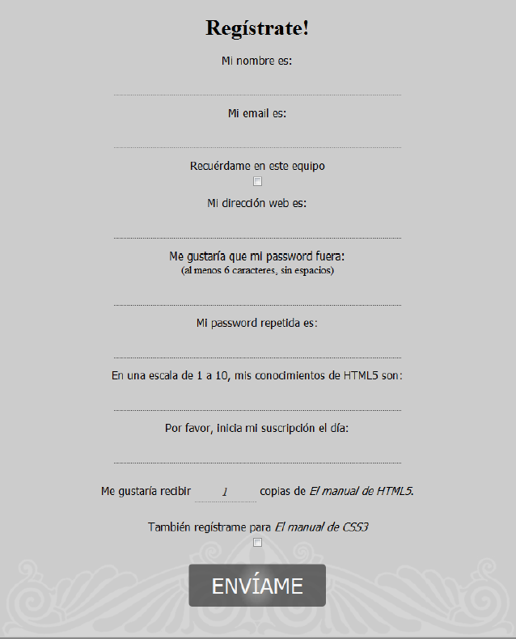
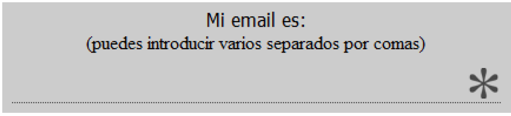
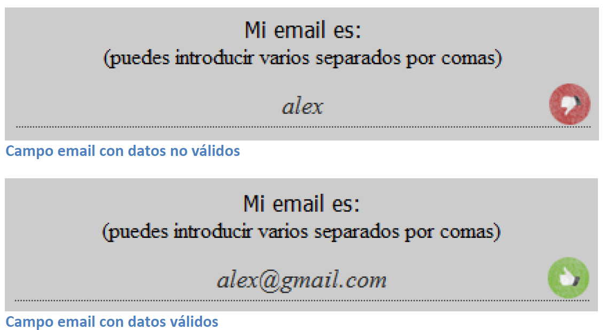
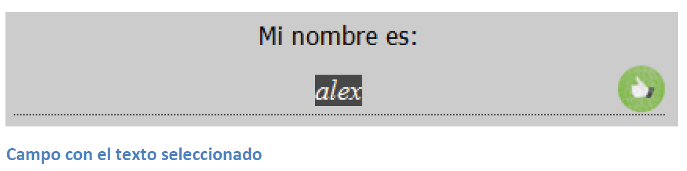
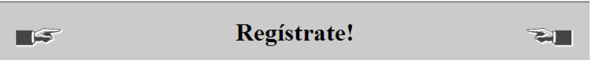
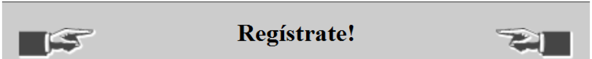
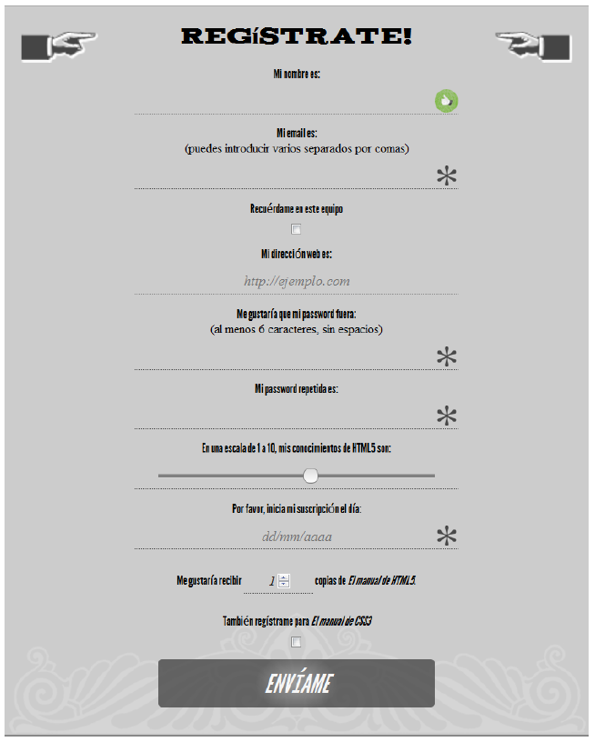
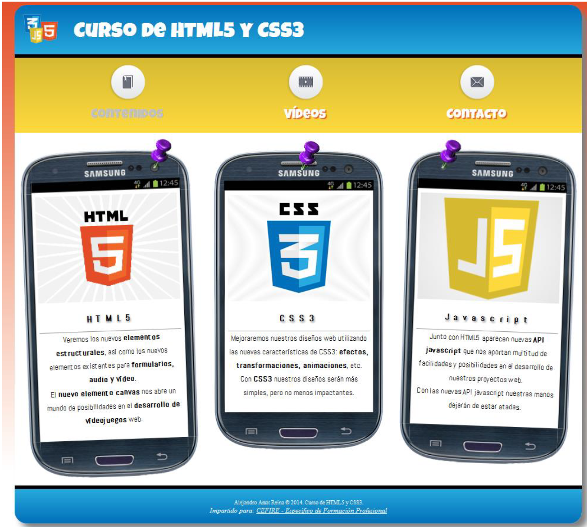
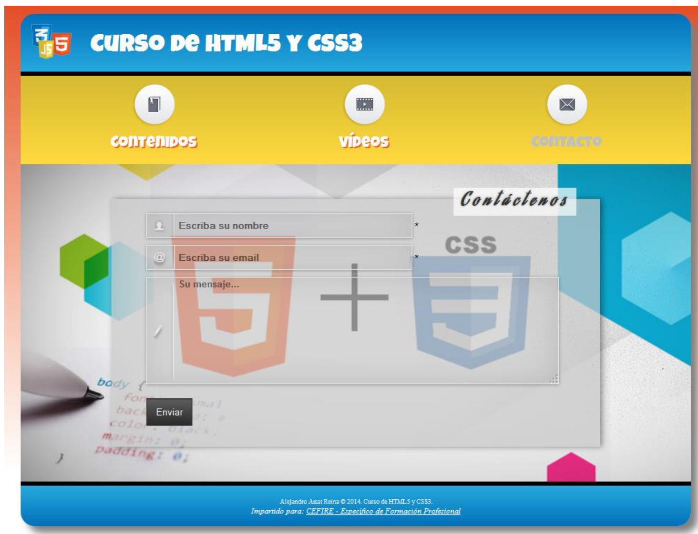

---
# Informació general del document
title: Práctica T04 - Formularios y Fuentes
author: Javier Beteta
date: 2022-01
subject: HTML5 CSS3 Formularios y Fuentes
lang: es

# Portada
titlepage: true
titlepage-rule-height: 2
titlepage-rule-color: 653097
#titlepage-background: ../background/portadaASGBD.png
page-background: ../background/background3.pdf

# Taula de continguts
toc-own-page: true
toc-title: Contenidos

# Capçaleres i peus
header-left: App WEB
header-right: Práctica 03
footer-left: Javier Beteta (Triangle)
footer-right: \thepage/\pageref{LastPage}

# Llistats de codi
listings-no-page-break: true
listings-disable-line-numbers: true

# Fitxer d'eixida


# Propietats de l'eixida (panrun)
output:
   to: pdf
   latex:
#     pdf-engine: xelatex
     from: markdown
#    template: eisvogel.latex
     listings: true
#     data-dir: /usr/share/mdfactory/
     number-sections: true
#   html:
#     highlight-style: haddock
#     number-sections: true
#     standalone: true
#     toc: true

header-includes:
   - \usepackage{lastpage}
---
# Introducción

Vamos a realizar un par de ejercicios. Primero mejoraremos yn formulario realizado con HTML4 con las mehjoras que podemos encontrar en HTML5.
En segundo lugar aplicaremos las mejoras a la web que estamos creando. Creando una nueva página con un formulario de contacto.

## Mejorar formulario.

Vamos a ver a continuación un ejemplo de formulario de registro codificado con los elementos antiguos existentes en HTML4/XHTML. Después, a medida que vayamos avanzando, mejoraremos este formulario aplicando los nuevos elementos que vayamos estudiando.

```html
<form id="registro" method="post">
     <h1>Regístrate!</h1>
     <ul>
          <li>
               <label for="nombre">Mi nombre es:</label>
               <input type="text" id="nombre" name="nombre">
          </li>
          <li>
               <label for="email">Mi email es:</label>
               <input type="text" id="email" name="email">
          </li>
          <li>
               <label for="recuerdame">Recuérdame en este equipo</label>
               <input type="checkbox" value="true" id="recuerdame">
          </li>
          <li>
               <label for="url">Mi dirección web es:</label>
               <input type="text" id="url" name="url">
          </li>
          <li>
               <label for="password">Me gustaría que mi password fuera:</label>
               <span>(al menos 6 caracteres, sin espacios)</span>
               <input type="password" id="password" name="password">
          </li>
          <li>
               <label for="conocimientos">En una escala de 1 a 10, mis conocimientos de HTML5  son:</label>
               <input type="text" id="conocimientos" name="conocimientos">
          </li>
          <li>
               <label for="fechaInicio">Por favor, inicia mi suscripción el día:</label>
               <input type="text" id="fechaInicio" name="fechaInicio">
          </li>
          <li>
               <label for="cantidad">Me gustaría recibir <input type="text" name="cantidad" id="cantidad" value="1"> copias de <cite>El manual de HTML5</cite>.</label>
          </li>
          <li>
               <label for="tambienCSS3">También reístrame para <cite>El manual de CSS3</cite></label>
               <input id="tambienCSS3" name="tambienCSS3" type="checkbox">
          </li>
          <li>
               <input type="submit" id="registro-submit" value="Envíame"/>
          </li>
     </ul>
</form>
```
Este formulario *registro.hml* lo podéis encontrar en el material de la práctica. Como así las imágenes utilizadas y el css aplicado al formulario.



Para ello utilizaremos los nuevos tipos de **<input>** ofrecidos por HTML5.
- search
- email
- url
- tel
- number (min, max, step)
- range (min, max, step)
- color
- date, month, week, time, datetime, datetime-local (min, max)

Nuevos atributos para los campos del formulario:
- required
- placeholder
- pattern
- multiple
- form
- autofocus
- readonly

Otros tipos de campos de HTML5:
- progress: Para describir el estado actual de un proceso. Ejemplo una descarga
- meter: Elemento cuyo rango se conoce. Ejemplo espacio libre en un disco
- datalist: se utiliza junto a otros elementos como un *select*
- output: Visualizar el resultado de un cálculo.

### API Forms

Existen diferentes formas de aprovechar el proceso de validación en HTML5: podemos usar los tipos de campo para activar el proceso de validación por defecto (por ejemplo, email) o convertir un campo como text (o cualquier otro) en un campo obligatorio usando el atributo required. También podemos crear campos con validaciones especiales usando el atributo pattern para personalizar requisitos de validación. Sin embargo, cuando se trata de aplicar mecanismos complejos de validación (por ejemplo, combinando campos o comprobando los resultados de un cálculo) deberemos recurrir a nuevos recursos provistos por esta API.

#### Personalizar los mensajes de error.
Podemos crear nuestras propias validaciones con mensajes de validación personalizados usando el método *setCustomValidity(mensaje)*.
El funcionamiento es muy sencillo, si en el momento del envío alguno de los campos tiene un mensaje personalizado no vacío, el navegador entenderá que ha habido un error de validación y mostrará el mensaje en el campo indicado. El error se eliminará cuando llamemos a la función setCustomValidity pasando un mensaje vacío: *setCustomValidity("")*.

Ejemplo:
```javascript
     function iniciar() {
          registro=document.getElementById("registro");
          password1=document.getElementById("password1");
          password2=document.getElementById("password2");
     /* El evento input se producir  cada vez que se pulse una tecla */
          password1.addEventListener("input", validacion, false);
          password2.addEventListener("input", validacion, false);
     }
     function validacion() {
          if(password1.value!==password2.value)
               password2.setCustomValidity('Las passwords deben coincidir');
          else
               password2.setCustomValidity('');
          }
     window.addEventListener("load", iniciar, false);
```
#### El evento *invalid*

Cada vez que el usuario envía el formulario, se dispara un evento llamado invalid si se detecta un campo que no pasa la validación. El evento es disparado por el elemento que produce el error. Podemos agregar un manejador para este evento y así ofrecer una respuesta personalizada. Por ejemplo, en el siguiente ejemplo se pondrá un color de fondo amarillo a aquellos elementos que no pasen la validación:

```javascript
     function iniciar() {
          registro=document.getElementById("registro");
          registro.addEventListener("invalid", accionInvalid, true);
     }
     function accionInvalid(evento) {
          /* obtenemos el elemento que no ha pasado la validaci n */
          var elemento = evento.target;
          elemento.style.background='yellow';
     }
     window.addEventListener("load", iniciar, false);
```

Este código tendrá un problema, y es que cuando corrijamos el error de validación, el campo seguirá con fondo amarillo. Más adelante veremos cómo hacer algo muy parecido (y más apropiado), evitando este inconveniente.


#### Controlar la validación
Para tener control absoluto sobre el envío del formulario y el momento de validación, podemos sustituir el **<input type="submit">** por un **<button>**.
Cuando se pulse este botón, el formulario se enviará, pero sólo si todos sus elementos son válidos. Para ello, debemos agregar un manejador para el evento click del botón. Usando el método checkValidity(), que nos devolverá true si no hay ningún campo que no pase la validación, solicitamos al navegador que realice el proceso de validación, y sólo enviamos el formulario, usando el tradicional método submit(), cuando ya no hay más condiciones inválidas.

```javascript
     function iniciar() {
          registro=document.getElementById("registro");
          registroSubmit=document.getElementById("registro-submit");
          registroSubmit.addEventListener("click", enviar, false);
     }
     function enviar() {
          if(registro.checkValidity()) {
               registro.submit();
          }
     }
     window.addEventListener("load", iniciar, false);
```

#### Validación en tiempo real
Uno de los problemas que tenemos en los ejemplos anteriores es que la validación se realiza sólo cuando pulsamos el botón enviar. Para poder realizar la validación en tiempo real a medida que el usuario va rellenando los campos, tenemos que aprovechar los atributos provistos por el objeto *ValidityState*, al cual accedemos en todos los campos de formulario a través de su propiedad validity. Este objeto tendrá las siguientes propiedades booleanas:
- valid: es true cuando el contenido actual del elemento es válido.
- valueMissing: es true cuando el atributo required fue declarado y el campo está vacío.
- typeMismatch: es true cuando la sintaxis de la entrada no corresponde con el tipo especificado (por ejemplo, si el texto insertado en un tipo de campo email no es una dirección de email válida).
- patternMismatch: es true cuando la entrada no corresponde con el patrón provisto por el atributo pattern.
- tooLong: es true cuando el atributo maxlength fue declarado y la entrada es más extensa que el valor especificado para este atributo.
- rangeUnderflow: es true cuando el atributo min fue declarado y la entrada es menor que el valor especificado para este atributo.
- rangeOverflow: es true cuando el atributo max fue declarado y la entrada es más grande que el valor especificado para este atributo.
- stepMismatch: es true cuando el atributo step fue declarado y su valor no corresponde con los valores de atributos como min, max y value.
- customError: es true cuando declaramos un error personalizado usando el método *setCustomValidity()* visto anteriormente.

Para controlar estos estados de validación, debemos utilizar la sintaxis *elemento.validity.estado* (donde estado es cualquiera de los valores listados arriba).
Podemos aprovechar estos atributos para realizar la validación del formulario a medida que se van introduciendo los datos de la siguiente manera:

```javascript
function validarEntrada(evento) {
     /* obtenemos el elemento sobre el que se est  produciendo la entrada */
     var elemento = evento.target;
     if (elemento.validity.valid)
          elemento.style.background = "transparent";
     else
          elemento.style.background = "yellow";   
}
function iniciar() {
     registro=document.getElementById("registro");
     /* el evento se producir  cuando se pulsa una tecla sobre cualquier campo del formulario */
     registro.addEventListener("input", validarEntrada, false);
}
window.addEventListener("load", iniciar, false);
```
De esta forma, el usuario sabrá si los datos son válidos a medida que los va introduciendo.

### Aplicando estilos

#### Aplicando estilos a campos requeridos inválidos

Podemos aplicar estilos a elementos de formularios requeridos con la pseudo-clase *:required*. Tambi´wn podemos aplicar estilos a campos válidos o no válidos con las pseudo-classes *:valid* e *:invalid*.

```css
     input { background: transparent no-repeat top right; }
     input:required { background-image: url('../images/required.png'); }
```


Muchas veces, no nos interesará aplicar el mismo estilo a todos los tipos de input, por ejemplo, los botones suelen tener estilos diferentes. Para solucionar esto, podemos utilizar la pseudo-clase :not.

```css
     input:not([type=range]):not([type=submit]):not([type=button]):not([type=checkbox])
     { background: transparent no-repeat top right;}
     input:not([type=range]):not([type=submit]):not([type=button]):not([type=checkbox]):required { background-image: url('../imgs/required.png');}
```

Con estas reglas, evitamos que se inserte la imagen del asterisco, en aquellos tipos de entrada que no nos interesa.

```css
input:not([type=range]):not([type=submit]):not([type=button]):not([type=checkbox]):invalid { background-image: url('../imgs/invalid.png');}

input:not([type=range]):not([type=submit]):not([type=button]):not([type=checkbox]):valid
{background-image: url('../imgs/valid.png');}
```


Un problema que nos encontramos es que aparecerá la imagen de campo válido o inválido en todos los campos del formulario a los que les hayamos aplicado los estilos, por lo tanto, la imagen de campo obligatorio no se mostrará. Para solucionar el problema, haremos que sólo se apliquen los estilos de campo válido o inválido cuando el elemento tenga el foco. Esto lo conseguimos utilizando la pseudo-clase *:focus*.

```css
input:not([type=range]):not([type=date]):not([type=submit]):not([type=button]):not([type=checkbox]):not([type=number]):focus:invalid {
     background-image: url('../imgs/invalid.png');
}
input:not([type=range]):not([type=date]):not([type=submit]):not([type=button]):not([type=checkbox]):not([type=number]):focus:valid {
     background-image: url('../imgs/valid.png');
}
```

Debemos tener en cuenta que algunos navegadores, como por ejemplo Firefox, muestran una sombra roja alrededor de los elementos inválidos. Para evitar esta incongruencia con el resto de navegadores podemos añadir la siguiente regla css:

```css
     :invalid { box-shadow: none; }
```

#### Estilos para el texto seleccionado
CSS3 incorpora un nuevo pseudo-elemento para el texto seleccionado de la página, de forma que podemos cambiar los estilos del texto que seleccionamos. Este selector es *::selection*.

```css
::-moz-selection{ background: #484848; color:#fff; text-shadow: none; }
::selection { background:#484848; color:#fff; text-shadow: none; }
```



#### Múltiples imagenes de fondo

Otra de las mejoras que incorpora CSS3 es que nos permite colocar más de una imagen de fondo a un mismo elemento. La sintaxis que utilizaremos para colocar múltiples imágenes de fondo a un elemento será la misma que para colocar una única imagen, simplemente separaremos los valores para cada imagen individual con una coma. Por ejemplo:

```css
     background-image:
          url(primeraImagen.jpg),
          url(segundaImagen.gif),
          url(terceraImagen.png);
     /*De la misma forma, podemos utilizar el atajo para la propiedad background:*/ 
     background:
          url(primeraImagen.jpg) no-repeat 0 0,
          url(segundaImagen.gif) no-repeat 100% 0,
          url(terceraImagen.png) no-repeat 50% 0;
```

Ejemplo:

```css
form h1 {
     font-size: 2em;
     padding-bottom: 20px;
     background:
          url(../imgs/bg-formtitle-left.png) left 13px no-repeat,
          url(../imgs/bg-formtitle-right.png) right 13px no-repeat;
}
```


#### Redimensionar imagenes de fondo
CSS3 también nos ofrece la posibilidad de redimensionar las imágenes de fondo mediante la propiedad background-size.

```css
form h1 {
     font-size: 2em;
     padding-bottom: 20px;
     background:
          url(../imgs/bg-formtitle-left.png) left 13px no-repeat,
          url(../imgs/bg-formtitle-right.png) right 13px no-repeat;
     -webkit-background-size: 100px auto;
     -moz-background-size: 100px auto;
     background-size: 100px auto;
}
```


### Modificar el HTML de *registro.html*

Según lo que hemos visto en el punto anterior, termina el formulario *registro.html* según las siguientes instrucciones:

En este ejercicio vamos a implementar todas las funcionalidades explicadas sobre el formulario de registro que hemos trabajado a lo largo del tema. Las funcionalidades que debe incorporar son las siguientes:
- Los siguientes campos serán obligatorios: nombre, email, password1, password2, fechaInicio.
- El campo email será de tipo email y aceptará múltiples valores.
- Cuando el formulario se cargue, el campo nombre recibirá el foco automáticamente.
- El campo url será de tipo url y el texto de ejemplo que aparecerá será: *http://ejemplo.com*
- Tanto el password1 como el password2, tendrán que contener, al menos seis caracteres sin espacios en blanco.
- El campo conocimientos será de tipo range con un valor mínimo de 1 y un valor máximo de 10.
- El campo fechaInicio será de tipo date y el texto de ejemplo que aparecerá será: dd/mm/aaaa
- El campo cantidad será de tipo number con un valor por defecto de 1, un valor mínimo de 0 y un valor máximo de 5.
- El botón de enviar será un button en lugar de un submit.
- Se realizarán las siguientes validaciones adicionales:
     - Los campos password1 y password2 deberán ser iguales para que el formulario pueda ser enviado. Esta validación se realizará a medida que se vayan pulsando teclas en el campo password1 o en el campo password2, y el mensaje que se mostrarña será el siguiente: "Las passwords deben coincidir".
     - El campo fechaInicio, deberá contener una fecha mayor o igual que la actual. Para obtener las fechas en JavaScript haremos lo siguiente:
          ```javascript
          fechaInicio=document.getElementById("fechaInicio");
          fechaActual = new Date();
          fechaIni = fechaInicio.valueAsDate;
          ```
     Una vez tenemos los objetos Date podemos compararlos como si fueran números. Esta validación la realizaremos al pulsar el botón enviar, antes de llamar al método submit.
- Los campos obligatorios se marcarán con la imagen *required.png*.
Cuando el foco está en un input que cumple la validación se marcará-  con la imagen *valid.png*.
- Cuando el foco está en un input que no cumple la validación se marcará con la imagen *invalid.png*.
- El texto seleccionado aparecerá con las siguientes características:
     - Color de fondo: #484848
     - Color de fuente: #fff
     - Sombra del texto: ninguna.
- El título del formulario tendrá dos imágenes de fondo, una a la izquierda (*bg-formtitle-left.png*) y otra a la derecha (*bg-formtitle-right.png*). Estas imágenes estarán redimensionadas a 100px de ancho y alto automático.
- Los **<label>** y el botón del formulario tendrán la fuente *LeagueGothic*.
- El título del formulario usará la fuente AcknowledgementMedium.
- Ambas fuentes deben ser incrustadas a la hoja de estilos.
El formulario resultante se verá como se muestra en la imagen:



Las imágenes y las fuentes necesarias, las podéis encontrar dentro de las carpetas imgs y fonts del fichero de recursos.
El ejercicio se guardará en una carpeta llamada registro que contendrá el documento registro.html, una carpeta css para los estilos, una carpeta imgs para las imágenes, una carpeta fonts para las fuentes y una carpeta scripts para el JavaScript.

## Ejercicio 2

En este segundo ejercicio seguiremos trabajando sobre nuestra página web del curso. En concreto, vamos a mejorar algo el aspecto de la página cambiando algunas de las fuentes, ya que las que estamos utilizando hasta ahora son bastante sosas.
Para la cabecera de la página y para la barra de navegación usaremos una fuente llamada *‘Luckiest Guy’*.
Para los contenidos de la página usaremos una fuente llamada *‘Abel’*.
Ambas fuentes están disponibles en Google Fonts, sólo tenéis que buscarlas e incorporarlas a vuestra hoja de estilos. Esto lo haremos en el fichero estilos.css para que afecte a toda la página.
Al cambiar la fuente en la barra de navegación, el efecto que queda en los textos hace que no se aprecie bien lo que hay escrito, por este motivo vamos a cambiar la sombra de los textos que pusimos en los enlaces de la barra de navegación.
Pondremos una sombra con distancia horizontal y vertical de 2px y color #f06529 para los enlaces en estado normal, y una sombra con distancia horizontal y vertical de 0px, radio de difuminación de 5px y color #ff7e42, para los enlaces en estado *:hover*.
Una vez cambiadas las fuentes, la página principal quedará como aparece en la siguiente imagen:



## Ejercicio 3

Para terminar, vamos a implementar la sección de contacto de nuestra página, que contendrá un formulario. Este formulario lo crearemos en un documento que llamaremos contacto.html y cuyo resultado será el que se muestra en la siguiente imagen:



Podéis ver esta imagen con mejor resolución dentro del fichero de recursos (*contacto.jpg*).
Lo primero que haremos será modificar las páginas *index.html* y *videos.html*, de forma que el enlace contacto apunte al documento *contacto.html*. Este documento será exactamente igual a los de las secciones de contenidos y vídeos, salvo dos excepciones: en la barra de navegación no habrá enlace en contacto y el contenido de la sección main será diferente.
Dentro de la sección *main* tendremos lo siguiente:
- Un **<div>** que contendrá el formulario y que tendrá el id contenedorFormulario. Dentro del **<div>** tendremos lo siguiente:
 - Un <h1> con el texto Contáctenos.
 - Un formulario con los siguientes campos:
    1. Un campo para solicitar el nombre del usuario que quiere contactar. Este campo será obligatorio y contendrá el texto de ejemplo siguiente: "Escriba su nombre".
    2. Un campo para solicitar el correo electrónico del usuario. Este campo será obligatorio y contendrá el texto de ejemplo siguiente: "Escriba su email".
    3. Un **<textarea>** para que el usuario escriba el mensaje que quiere enviar. Este campo será obligatorio y contendrá el texto de ejemplo siguiente: "Su mensaje…".
    4. Un botón submit para enviar los datos del formulario.
   
Para que el formulario tome el aspecto que se muestra en la imagen, tendremos que aplicar una serie de estilos que crearemos en un fichero llamado *contacto.css* dentro de la carpeta css. Dentro de este fichero crearemos los siguientes estilos:

- Sección main:
 - Pondremos la imagen de fondo fondoForm.jpg, indicando que la imagen abarque todo el espacio de la sección.
 - Sus contenidos estarán centrados.
- Contenedor del formulario:
 - La posiciÓn serÁ relativa.
 - Se mostrará como inline-block.
 - Márgenes de 50px.
 - Ancho 600px.
 - Margen interno superior e inferior 20px, izquierdo y derecho 50px.
 - Color de fondo rgb: 200, 200, 200 con una opacidad de 0.7.
 - Contenidos alineados a la izquierda.
 - Sombra de la caja con los siguientes valores: desplazamiento horizontal 3px, desplazamiento vertical 0px, distancia de difuminación 8px y color rgb: 0, 0, 0 con una opacidad de 0.4.
- Título del formulario:
 - Posición absoluta con una distancia al borde superior de -16px y al borde izquierdo de 490px.
 - Color de fondo rgb: 255, 255, 255 con una opacidad de 0.7.
 - Fuente Aguafina Script en cursiva y color #333. Esta fuente es una fuente de google, por lo que, debemos buscarla y enlazarla correctamente mediante un @import.
 - Espacio entre letras 5px.
 - Sombra del texto con distancia horizontal y vertical de 0px, radio de difuminación de 2px y color #777.
 - Márgenes internos superior e inferior de 0px e izquierdo y derecho de 10px.
- Estilos comunes para todos los campos del formulario, excepto el botón:
 - Se mostrarán como inline-block.
 - Borde de 1px, estilo sólido y color #e5e5e5.
 - Tendrán dos sombras de caja3:
    1. La primera con las siguientes características: Desplazamiento horizontal 0px, desplazamiento vertical 1px, distancia de difuminación 4px y color rgb: 0, 0, 0 con una opacidad de 0.3.
    2. La segunda con las siguientes características: Desplazamiento horizontal 0px, desplazamiento vertical 0px, distancia de difuminación 40px y color rgb: 0, 0, 0 con una opacidad de 0.1. Esta sombra será interna (inset).
 - Color de fuente negro.
 - Fuente en negrita.
 - Márgenes internos superior e inferior de 1px, izquierdo 45px y derecho de 4px.
 - Margen inferior 10px.
 - Configuraremos una transición para el cambio de todas las propiedades de estos elementos de la siguiente forma: duración 0.4s, propiedad all, efecto ease-in.
- Estilos comunes para los campos nombre y correo:
 - Alto 32px.
 - Ancho 330px.
 - Al obtener el foco estos campos, se cambiará el ancho a 370px y la sombra de la caja que tendrá las siguientes características: Desplazamiento horizontal 0px, desplazamiento vertical 0px, distancia de difuminación 12px y color rgb: 255, 255, 255. (Como habíamos creado una transición para todos los campos, estos cambios serán animados).
 - El campo nombre tendrá la imagen de fondo *icon-nombre.png* y el campo correo *icon-correo.png*. No se repetirán y estarán colocadas a una distancia de 10px del borde izquierdo.
 - Al obtener el foco en uno de los dos campos pueden pasar dos cosas:
    1. Que la validación del campo sea correcta, con lo que, además de la imagen indicada anteriormente, tendrá también la imagen valid.png como fondo, tampoco se repetirá y estará colocada a 390px del borde izquierdo.
    2. Que la validación del campo no sea correcta, con lo que, además de la imagen indicada anteriormente, tendrá también la imagen invalid.png como fondo, tampoco se repetirá y estará colocada a 390px del borde izquierdo.
 - Si nos fijamos en la imagen, tanto el campo nombre como el campo correo tienen un asterisco ‘*’ a la derecha que indica que ambos campos son requeridos. Para hacer esto haremos lo siguiente:
    1. En el documento html añaadiremos un **<label>** vacío a continuación del cada **<input>**.
    2. En la hoja de estilos indicaremos una regla para seleccionar los input que sean requeridos y tengan un hermano adyacente de tipo **<label>**. En esta regla indicaremos que se añada después del elemento (::after) el contenido ‘ *’ (content: ‘ *’;).
- Campo mensaje:
 - Fuente arial.
 - Tamaño de fuente 1em.
 - Ancho 90%.
 - Alto 150px.
 - Imagen de fondo icon-mensaje.png. No se repetirá y estará colocada a una distancia de 10px del borde izquierdo.
 - Al obtener el foco se cambiará la sombra de la caja como sigue: desplazamiento horizontal 0px, desplazamiento vertical 0px, distancia de difuminación 12px y color rgb: 255, 255, 255. (Como habíamos creado una transición para todos los campos, este cambio será animado).
- Botón enviar:
 - Márgenes superior e inferior de 10px, izquierdo y derecho de 0px.
 - Márgenes internos de 10px.
 - Borde de 1px, estilo sólido y color #434343.
 - Color de fuente blanco.
 - Como fondo le pondremos un gradiente de arriba abajo iniciando en el color #5e5e5e y acabando en el color #2a2a2a.
 - La sombra de la caja será así: desplazamiento horizontal 0px, desplazamiento vertical 1px, distancia de difuminación 1px, color #353535 y tipo de sombra inset.
 - Cursor del ratón pointer.
 - Al poner el ratón sobre el botón se pondrá el mismo gradiente de fondo, pero al contrario, es decir, en lugar de arriba abajo, de abajo arriba.

Además de todo esto, el formulario tiene que validarse de la siguiente forma:
- El campo nombre, tiene que ser uno de los siguientes: alex, juan, ana o pedro. Para ayudar a la entrada de usuario crearemos un **<datalist>** que contendrá estos nombres y asociaremos al campo. A medida que el usuario vaya pulsando teclas estando en el campo, se validará si el usuario que hay en el campo es uno de los válidos. Si al pulsar enviar el usuario no es válido se mostrará el mensaje de error "El usuario introducido no existe".
El campo correo debe contener una dirección de correo de un dominio español, es decir, debe acabar en ".es". A medida que el usuario vaya pulsando teclas estando en el campo, se validará si el correo que hay en el campo es válido. Si al pulsar enviar el correo no es válido se mostrará el mensaje de error "Debes introducir una dirección de correo española (acabada en .es)".
Estas validaciones las realizaremos en un fichero JavaScript llamado *contacto.js*.
Todos los ficheros (imágenes, fuentes, etc.) necesarios para la realización del ejercicio, los pod´wis encontrar en el fichero de recursos.

No olvid´wis pasar el validador tanto a los *html* como a los *css*
  


