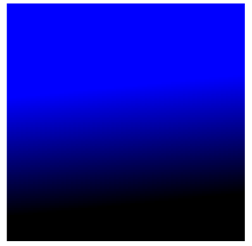

---
# Informació general del document
title: Práctica T05 - Videojuegos con HTML5 (Canvas)
author: Javier Beteta
date: 2022-01
subject: HTML5 CSS3 Videojuegos con HTML5 (Canvas)
lang: es

# Portada
titlepage: true
titlepage-rule-height: 2
titlepage-rule-color: 653097
#titlepage-background: ../background/portadaASGBD.png
page-background: ../background/background3.pdf

# Taula de continguts
toc-own-page: true
toc-title: Contenidos

# Capçaleres i peus
header-left: App WEB
header-right: Práctica 05
footer-left: Javier Beteta (Triangle)
footer-right: \thepage/\pageref{LastPage}

# Llistats de codi
listings-no-page-break: true
listings-disable-line-numbers: true

# Fitxer d'eixida


# Propietats de l'eixida (panrun)
output:
   to: pdf
   latex:
#     pdf-engine: xelatex
     from: markdown
#    template: eisvogel.latex
     listings: true
#     data-dir: /usr/share/mdfactory/
     number-sections: true
#   html:
#     highlight-style: haddock
#     number-sections: true
#     standalone: true
#     toc: true

header-includes:
   - \usepackage{lastpage}
---
# Introducción
En el tema anterior vimos cómo crear interfaces de usuario utilizando los nuevos elementos para formularios introducidos con HTML5. También vimos cómo controlar la validación de estos formularios mediante la nueva API Forms. En este quinto tema, veremos un elemento no menos importante, el nuevo elemento **\<canvas\>** de HTML5, creado para cubrir las carencias que teníamos anteriormente para el dibujo de objetos gráficos y el desarrollo de videojuegos sin necesidad de utilizar plug-ins externos.

Nos centraremos, sobre todo, en la creación de videojuegos sencillos (dejando un poco de lado el manejo de gráficos), para lo cual, no tendremos más remedio que utilizar JavaScript, pero trabajaremos sobre un ejemplo sencillo y no nos meteremos en detalles demasiado complejos.
Asimismo, en temas anteriores vimos cómo crear transiciones (pequeñas animaciones) sobre elementos de nuestra página. Veremos en este tema, cómo encadenar estas transiciones utilizando para ello las animaciones CSS3.
Además, veremos cómo podemos controlar la reproducción de estas animaciones y encadenar una tras otra, utilizando para ello los nuevos eventos para animaciones incorporados al lenguaje JavaScript.

# Videojuegos con HTML5

Al comienzo del curso hablamos sobre cómo HTML5 está reemplazando complementos o plug-ins anteriores, como Flash o Java applets, por ejemplo. Había dos cosas importantes a considerar para independizar a la web de tecnologías desarrolladas por terceros: procesamiento de video y aplicaciones gráficas. El elemento **\<video\>** y la API para medios cubren el primer aspecto muy bien, pero nos faltaría cubrir el tema de los gráficos y los videojuegos. La API Canvas se hace cargo del aspecto gráfico y lo hace de una forma extremadamente efectiva. Canvas nos permite dibujar, presentar gráficos en pantalla, animar y procesar imágenes y texto, y trabaja junto con el resto de la especificación para crear aplicaciones completas e incluso videojuegos en 2 y 3 dimensiones para la web.
Esta API ofrece una de las más poderosas características de HTML5. Permite a desarrolladores trabajar con un medio visual e interactivo para proveer capacidades de aplicaciones de escritorio para la web.
## El elemento **\<canvas\>**

Este elemento genera un espacio rectangular vacío en la página web (lienzo), en el cual serán mostrados los resultados de ejecutar los m´wtodos provistos por la API. Al crearlo, obtendremos únicamente un espacio en blanco, como un elemento **\<div\>** vacío, pero con un propósito totalmente diferente.

```html
     <canvas id="lienzo" width="500" height="300">
          Su navegador no soporta el elemento canvas
     </canvas>
```
Como se puede observar en el ejemplo, sólo es necesario especificar unos pocos atributos para este elemento. Los atributos width (ancho) y height (alto) declaran el tamaño del lienzo en píxeles. Estos atributos son necesarios debido a que todo lo que sea dibujado sobre el elemento tendrá esos valores como referencia. Siempre indicaremos un atributo id, para poder acceder fácilmente al elemento desde el código JavaScript.
Básicamente, lo que hace el elemento **\<canvas\>** es crear una caja vacía en la pantalla. Después, a través de JavaScript, utilizaremos los nuevos métodos y propiedades introducidos por la API para sacarle el máximo partido a esta superficie.
Por razones de compatibilidad, en caso de que el navegador no soporte este elemento, el contenido entre las etiquetas **\<canvas\>** será mostrado por pantalla.

## Acceder al elemento **\<canvas\>** desde JavaScript

Para acceder al elemento **\<canvas\>** desde JavaScript, en primer lugar, accederemos al objeto DOM del elemento, normalmente, a través del método getElementById, y posteriormente, utilizaremos el método getContext para obtener el contexto de dibujo, sobre el cual, podremos dibujar.

```javascript
     var lienzo=null, canvas=null;
     function iniciar() {
          canvas=document.getElementById('lienzo');
          lienzo=canvas.getContext('2d');
     }
     window.addEventListener("load", iniciar, false);
```

En el ejemplo, guardamos una referencia al elemento **\<canvas\>** en la variable elemento y el contexto de dibujo lo creamos utilizando getContext('2d'). Con esto obtenemos un contexto para dibujar en 2 dimensiones. Las últimas versiones de los navegadores, ya soportan el contexto en 3 dimensiones, pero por motivos obvios de tiempo, no lo veremos en este curso.
El contexto de dibujo del lienzo será una tabla de píxeles listados en filas y columnas de arriba a abajo y de izquierda a derecha, con su origen (el píxel 0,0) ubicado en la esquina superior izquierda del lienzo.

## Dibujando en el lienzo

Una vez que tenemos acceso al contexto del **\<canvas\>** podemos comenzar a crear y manipular gráficos. La API Canvas dispone de una extensa lista de herramientas para este propósito, desde la creación de simples formas y métodos de dibujo, hasta texto, sombras o transformaciones complejas. No vamos a estudiar con detenimiento las posibilidades gráficas que nos ofrece este API, pero sí que veremos las nociones básicas necesarias para poder desarrollar un pequeño videojuego.

### Dibujando rectángulos
Normalmente, el desarrollador deberá preparar la figura a ser dibujada en el contexto, pero existen algunos métodos que nos permiten dibujar directamente en el lienzo, sin preparación previa. Estos métodos son específicos para formas rectangulares y son los únicos que generan una forma primitiva (para obtener otras formas tendremos que combinar otras técnicas de dibujo y trazados complejos). Para el propósito que nos ocupa, nos bastará con ver el método *fillRect(x, y, ancho, alto)* que dibuja un rectángulo relleno. La esquina superior izquierda estará ubicada en la posición especificada por los parámetros x e y. Los parámetros ancho y alto declaran el tamaño.

```javascript
     var lienzo=null, canvas=null;
     function iniciar() {
          canvas=document.getElementById('lienzo');
          lienzo=canvas.getContext('2d');
          lienzo.fillRect(110,110,100,100);
     }
     window.addEventListener("load", iniciar, false);
```
En el ejemplo, el contexto fue asignado a la variable global lienzo, y ahora usamos esta variable para referenciar el contexto en cada método de dibujo.
El método *fillRect(110,110, 100,100)* del ejemplo, dibuja un rectángulo relleno, comenzando desde la posición 110,110 del lienzo y con un ancho y un alto de 100 píxeles, es decir, se tratará de un cuadrado.

### Colores
Hasta el momento, hemos usado el color por defecto (negro), pero podemos especificar el color que queremos aplicar utilizando la propiedad fillStyle. Esta propiedad declara el color para el interior de la figura (el relleno).
Podemos modificar el ejemplo anterior de la siguiente forma para cambiar el color del cuadrado:
```javascript
     var lienzo=null, canvas=null;
     function iniciar(){
          canvas=document.getElementById('lienzo');
          lienzo=canvas.getContext('2d');
          lienzo.fillStyle="#000099";
          lienzo.fillRect(110,110,100,100);
     }
     window.addEventListener("load", iniciar, false);
```
En el ejemplo, los colores fueron declarados usando números hexadecimales. También podemos usar funciones como *rgb()*, o incluso, especificar transparencia para la figura aprovechando la función *rgba()*. Estos métodos deben ser escritos entre comillas (por ejemplo, *fillStyle="rgba(255,165,0,1)")*.
Cuando especificamos un nuevo color este se convertirá en el color por defecto para el resto de los dibujos, a menos que volvamos a cambiarlo más adelante.

### Gradientes
Al igual que en CSS3, los gradientes en la API Canvas pueden ser lineales o radiales, y pueden incluir puntos de terminación para combinar colores:
- *createLinearGradient(x1, y1, x2, y2)*: este método crea un objeto que luego será usado para aplicar un gradiente lineal al lienzo.
- *createRadialGradient(x1, y1, r1, x2, y2, r2)*: este método crea un objeto que luego será usado para aplicar un gradiente circular o radial al lienzo usando dos círculos. Los valores representan la posición del centro de cada círculo y sus radios.
- addColorStop(posición, color): este método especifica los colores que usará el gradiente. El atributo posición es un valor entre 0.0 y 1.0 que determina dónde la degradación comenzará para ese color en particular.

```javascript
     var lienzo=null, canvas=null;
     function iniciar(){
          canvas=document.getElementById('lienzo');
          lienzo=canvas.getContext('2d');
          var gradiente=lienzo.createLinearGradient(0,0,10,100);
          gradiente.addColorStop(0.5, '#0000FF');
          gradiente.addColorStop(1, '#000000');
          lienzo.fillStyle=gradiente;
          lienzo.fillRect(10,10,100,100);
     }
     window.addEventListener("load", iniciar, false);
```


Como vemos, creamos el objeto gradiente desde la posición (0,0) a la (10,100), otorgando una leve inclinación hacia la izquierda. Los colores los declaramos con el método *addColorStop()* y el gradiente logrado se aplica a la propiedad *fillStyle*, como si se tratara de un color regular.
Es importante tener en cuenta que las posiciones del gradiente corresponden al lienzo, no a las figuras que queremos afectar. Por lo tanto, si movemos el rectángulo dibujado a una nueva posición, el gradiente cambiará.

### Dibujar textos
Escribir texto en el lienzo es tan simple como definir unas pocas propiedades y llamar al m´wtodo apropiado. Para configurar como se insertará el texto disponemos de tres propiedades:
- *Font*: Esta propiedad tiene una sintaxis similar a la propiedad font de CSS, y acepta los mismos valores.
- *textAlign*: Esta propiedad alinea el texto. Existen varios valores posibles: start (comienzo), end (final), left (izquierda), right (derecha) y center (centro).
- *textBaseline*: Esta propiedad es para alineamiento vertical. Establece diferentes posiciones para el texto. Los posibles valores son: top, hanging, middle, alphabetic, ideographic y bottom.
Para dibujar un texto con las letras rellenas utilizaremos el método *fillText(texto, x, y)*. Del mismo modo que el método fillRect para el trazado, este método dibujará el texto especificado en la posición x, y como una figura rellena. Puede también incluir un cuarto valor para declarar el tamaño máximo. Si el texto es más extenso que este último valor, será encogido para caber dentro del espacio establecido.

```javascript
     var lienzo=null, canvas=null;
     function iniciar(){
          canvas=document.getElementById('lienzo');
          lienzo=canvas.getContext('2d');
          lienzo.font="bold 24px verdana, sans-serif";
          lienzo.textAlign="start";
          lienzo.fillText("Mi mensaje", 100,100);
     }
     window.addEventListener("load", iniciar, false);
```

Como podemos ver en el ejemplo, la propiedad font puede tomar varios valores a la vez, usando exactamente la misma sintaxis que *CSS*. En este caso la propiedad textAling hace que el texto sea dibujado desde la posición 100,100 (si el valor de esta propiedad fuera *end*, por ejemplo, el texto terminaría en la posición 100,100). Finalmente, el método *fillText* dibuja un texto sólido en el lienzo.
Existen otros métodos para trabajar con textos en el API Canvas, pero con este tendremos suficiente para nuestro propósito.

### Mostrar imágenes
En el API Canvas disponemos del método drawImage para trabajar con imágenes. Este método nos permitirá dibujar una imagen en el lienzo. Sin embargo, puede recibir un número de valores que producen diferentes resultados. Estudiemos estas posibilidades:
- *drawImage(imagen, x, y)*: Esta sintaxis es para dibujar una imagen en el lienzo en la posición declarada por x e y. El primer valor es una referencia a la imagen que será dibujada.
- *drawImage(imagen, x, y, ancho, alto)*: Esta sintaxis nos permite escalar la imagen antes de dibujarla en el lienzo, cambiando su tamaño con los valores de los parámetros ancho y alto.
- drawImage(imagen, x1, y1, ancho1, alto1, x2, y2, ancho2, alto2)*: Esta es la sintaxis más compleja. Hay dos valores para cada parámetro. El propósito es cortar partes de la imagen y luego dibujarlas en el lienzo con un tamaño y una posición específica. Los valores x1 e y1 declaran la esquina superior izquierda de la parte de la imagen que será cortada. Los valores ancho1 y alto1 indican el tamaño de esta pieza. El resto de los valores (x2, y2, ancho2 y alto2) declaran el lugar donde la pieza será dibujada en el lienzo y su nuevo tamaño, el cual puede ser igual o diferente al original. Este método viene muy bien cuando tenemos sprites de imágenes, pero nosotros no los vamos a utilizar.
  
En todos los casos, el primer atributo puede ser una referencia a una imagen en el mismo documento generada por métodos como *getElementById*, o creando un nuevo objeto imagen usando métodos regulares de JavaScript. No es posible usar una URL o cargar un archivo desde una fuente externa directamente con este método.

```javascript
     var lienzo=null, canvas=null;
     function iniciar(){
          canvas=document.getElementById('lienzo');
          lienzo=canvas.getContext('2d');
          var imagen=new Image();
          imagen.src="imgs/fruit.png";
          imagen.addEventListener("load", function(){
               lienzo.drawImage(imagen,20,20)}, false);
          }
     window.addEventListener("load", iniciar, false);
```
El ejemplo anterior lo único que hace es cargar la imagen y dibujarla en el lienzo. Debido a que el lienzo sólo puede dibujar imágenes que ya están completamente cargadas, necesitamos controlar esta situación escuchando al evento load de la imagen. Agregamos una escucha para este evento y declaramos una función anónima para responder al mismo. El método drawImage dentro de esta función dibujará la imagen cuando esté completamente cargada.


