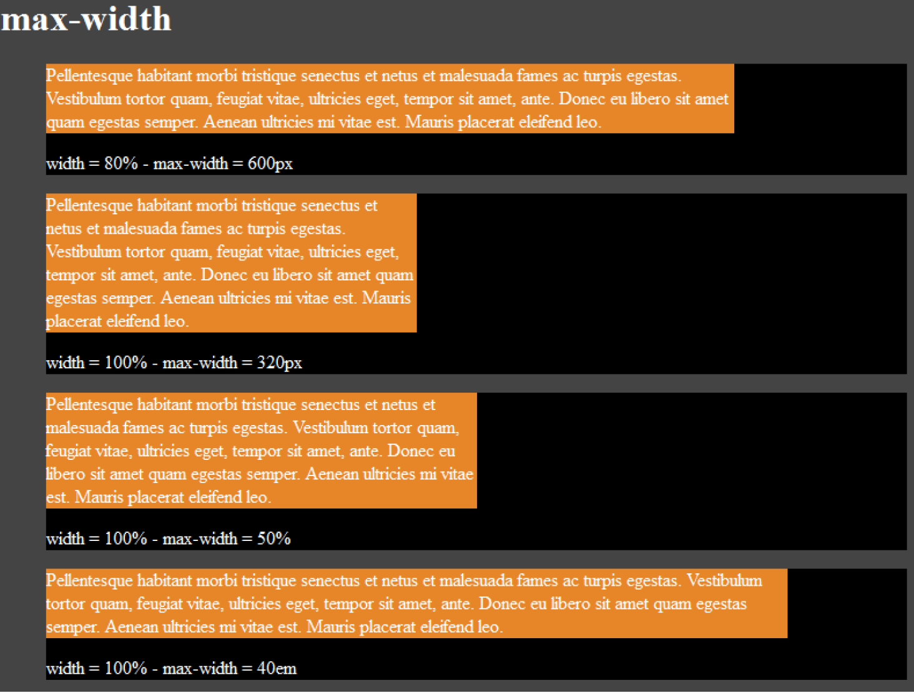
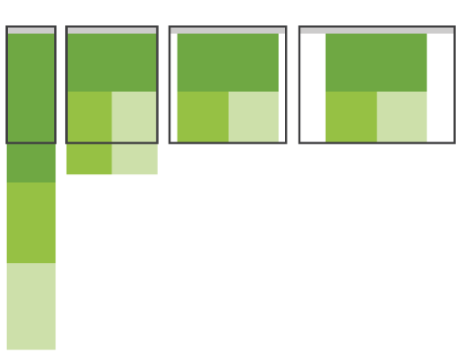
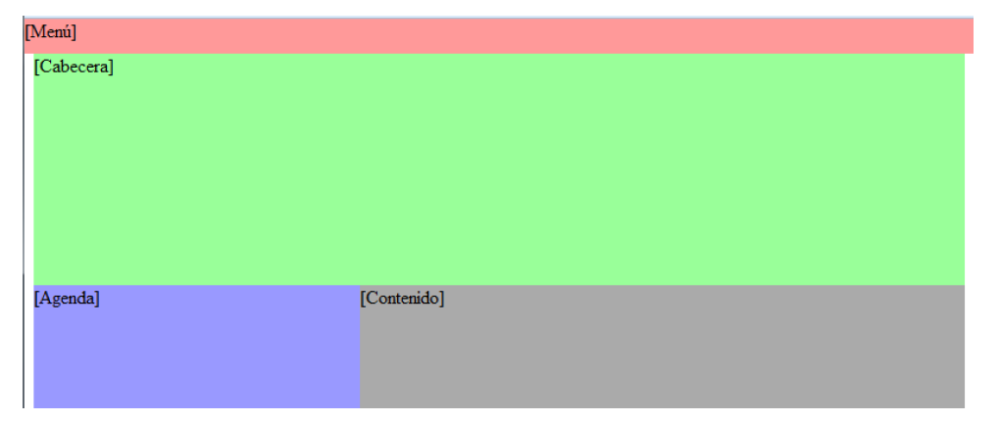
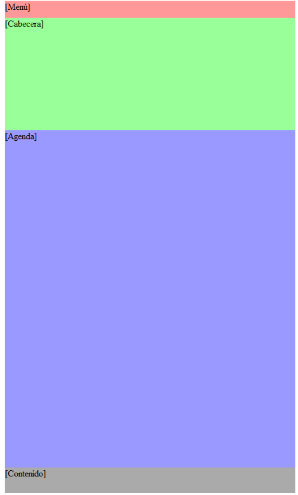
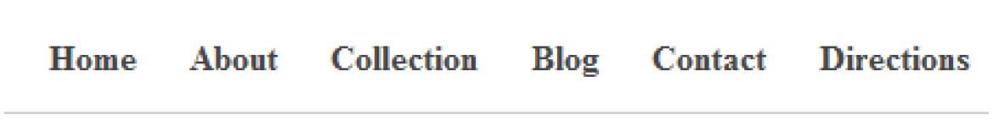
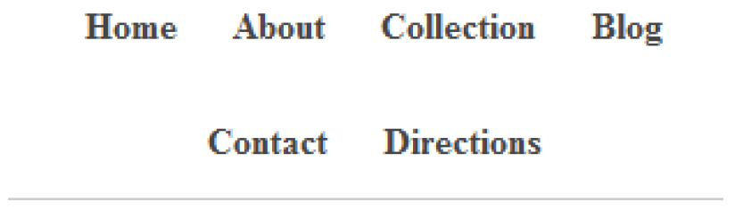
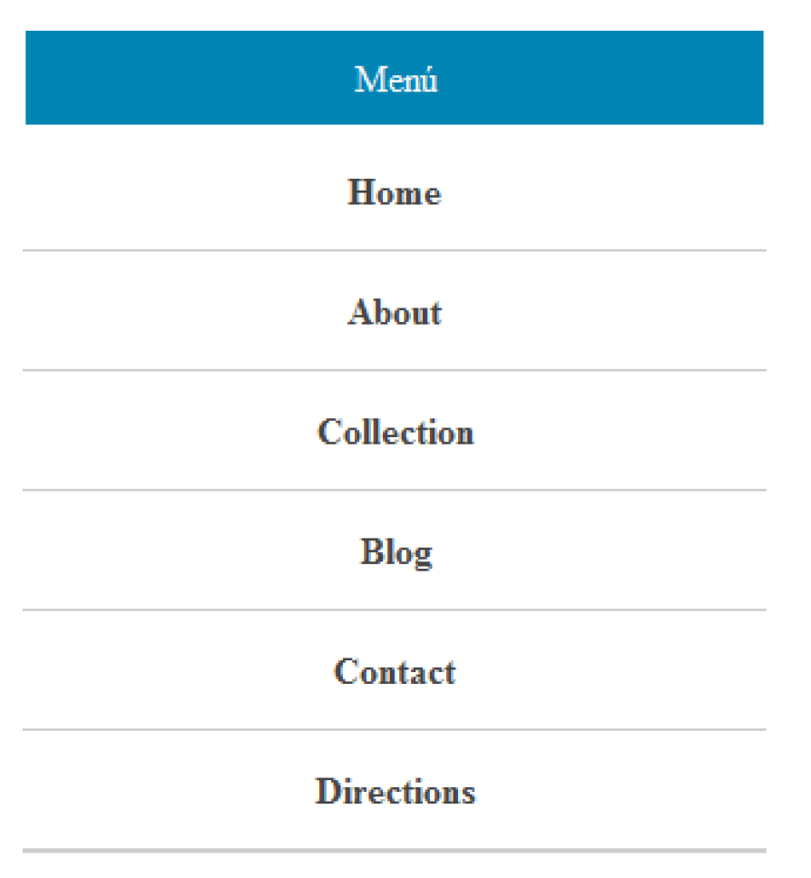

---
# Informació general del document
title: Práctica T06 - Resposive Web Desig (Canvas)
author: Javier Beteta
date: 2022-01
subject: Responsive Web Design (Canvas)
lang: es

# Portada
titlepage: true
titlepage-rule-height: 2
titlepage-rule-color: 653097
#titlepage-background: ../background/portadaASGBD.png
page-background: ../background/background3.pdf

# Taula de continguts
toc-own-page: true
toc-title: Contenidos

# Capçaleres i peus
header-left: App WEB
header-right: Práctica 06
footer-left: Javier Beteta (Triangle)
footer-right: \thepage/\pageref{LastPage}

# Llistats de codi
listings-no-page-break: true
listings-disable-line-numbers: true

# Fitxer d'eixida


# Propietats de l'eixida (panrun)
output:
   to: pdf
   latex:
#     pdf-engine: xelatex
     from: markdown
#    template: eisvogel.latex
     listings: true
#     data-dir: /usr/share/mdfactory/
     number-sections: true
#   html:
#     highlight-style: haddock
#     number-sections: true
#     standalone: true
#     toc: true

header-includes:
   - \usepackage{lastpage}
---
# Páginas Adaptables (Resposible Web Design), introducción

El diseño web adaptable o adaptativo (en inglés, Responsive Web Design) es una filosofía de diseño y desarrollo web que, mediante el uso de estructuras e imágenes fluidas, así como de **@media queries** en la hoja de estilo CSS, consigue adaptar el sitio web al entorno del usuario.

## Origen
Tanto la idea como el propósito del diseño web adaptable fueron previamente discutidos y descritos por el consorcio W3C en julio de 2008 en su recomendación *"Mobile Web Best Practices"* bajo el subtítulo "*One Web*".
Dicha recomendación, aunque específica para dispositivos móviles, puntualiza que está hecha en el contexto de "*One Web*", y que, por lo tanto, no sólo engloba la experiencia de navegación en dispositivos móviles, sino también en dispositivos de mayor resolución de pantalla como dispositivos de sobremesa.
Hoy en día, la variedad de dispositivos existentes en el mercado ha provocado que la información disponible no sea accesible desde todos los dispositivos, o bien es accesible, pero la experiencia de navegación es muy pobre.
## Ventajas
La principal ventaja que encontramos con el diseño web adaptable es que la web se visualizará correctamente en todos los dispositivos que usemos y se adaptará a los giros en dispositivos móviles.
Además, *Google* tiene en cuenta las páginas web que tienen diseños sensibles o adaptables, gracias a su *Googlebot-Mobile*. El personal de *Google* recomienda que se use el Responsive Design para crear páginas web que se adapten a todos los dispositivos con el uso de *@media-queries*. La alternativa sería usar distinto código según el agente del dispositivo, o incluso, distintas URLs. *Google* nos incita a usar este método porque, de esta forma, *Googlebot* no necesita analizar tanto contenido de la misma web, lo que le facilita la labor de asignar el tipo de contenido de la página y de esta forma mejorará el *SEO* de la web.
Otro factor, que normalmente no tenemos en cuenta a la hora de hacer un diseño, es la accesibilidad del mismo, que dificulta algunas veces el uso de una web a un disminuido visual. Con un diseño adaptable que aproveche el espacio de la página podemos ofrecer una página de calidad para este colectivo.
A continuación, veremos lo esencial para crear un diseño web adaptable: el meta-tag Viewport, las **@media queries**, etc.
## Viewport
Esta *meta-etiqueta* fue creada en principio por *Apple* para su móvil predilecto, pero se ha convertido en todo un estándar que es soportado por la mayoría de los dispositivos móviles (*smartphones*, *tablets* y gran parte de móviles de gama media y baja).
Su uso es totalmente necesario, ya que sino el navegador establece el ancho con el que prefiere visualizar una página, en lugar de usar el ancho del que dispone, es decir, si la pantalla de nuestro móvil tiene 400px y el navegador detecta que lo óptimo sería visualizarla con 700px, así lo hará, a no ser que usemos este meta).
Como siempre, el meta lo añadiremos en el **\<head\>** de nuestra página:

```html
<meta name="viewport" content="width=device-width, initial-scale=1.0, user-scalable=no">
```

Se pueden usar los siguientes parámetros (separados por comas):
- *width*: ancho de la página (se puede establecer en píxeles o como *device-width* y usará el ancho del que dispone el dispositivo).
- *height*: alto de la página, actúa igual que el width.
- *initial-scale*: escala o zoom inicial de la página (este y los demás tipos de escala se establecen con valores como 1.0 para no tener zoom o 2.5 para tener un zoom de 2 aumentos y medio, por ejemplo).
- *minimum-scale*: zoom mínimo que podemos hacer en la página.
- *maximum-scale*: zoom máximo que podemos hacer en la página.
- *user-scalable*: establece si está permitido o no hacer zoom (yes/no).

## Preparar nuestra página para el diseño adaptable
Para lograr que nuestra web se adapte a los anchos de pantalla, debemos tener en cuenta varias cosas importantes:
- La primera, y la más importante, es dejar de usar píxeles en todos los sitios, en su lugar, usaremos porcentajes (por ejemplo: width: 60%). Para saber qué porcentajes debemos de poner, haremos la siguiente operación: Supongamos que tenemos un elemento con un ancho de 960 píxeles y, dentro de este, tenemos otro elemento de 300 píxeles. Al elemento externo le pondremos, por ejemplo, un *width* del 90% para que se adapte al tamaño de la ventana y para que el elemento interno mantenga la proporción con respecto al externo calcularemos el ancho que debería tener así: 300/960, lo cual, nos dará 0,3125. Por lo tanto, el *width* que le pondremos al elemento interno será 31,25%.
- Para limitar el ancho (o alto si se terciara) debemos de usar el parámetro *max-width* (*max-height* en el caso del alto). Para establecer el mínimo usaremos *min-width* y *min-height*, aunque estos se utilizan menos. El valor de estas propiedades sobrescribirá el valor de las propiedades *width* y *height*. Por ejemplo, si indicamos *width*: 100% y *max-width*: 600px, cuando visualicemos la página con una resolución de 1200px, el ancho será de 600px, ya que es el valor máximo que hemos indicado para el ancho (puedes ver un ejemplo de uso en el fichero *max-width.html* de la carpeta de recursos). En este ejemplo, tenemos cuatro elementos configurados con distintas combinaciones de *width* y *max-width*. Si vamos cambiando el ancho de la ventana del navegador, veremos cómo los anchos se van adaptando hasta llegar a los anchos máximos configurados, momento en el cual, el ancho permanecerá invariable. En la siguiente imagen podemos observar cómo se muestra el ejemplo.



- No debemos usar posiciones absolutas ni fijas (salvo contadas excepciones).
- Nunca debemos permitir que una imagen de fondo que está pensada para no repetirse, llegue a repetirse por el cambio de dimensiones. Para evitarlo, debemos adaptarla, normalmente, usando **@media-queries**.
- Tampoco debemos permitir que las imágenes y los vídeos se salgan de la estructura, sino aparecerá un scroll lateral en los dispositivos móviles que destrozará totalmente el diseño.

### **media-queries**
Desde los días de CSS 2.1, nuestras hojas de estilos han disfrutado de “una conciencia del dispositivo” a través de los *media type**. Por ejemplo cuando creamos una hoja de estilos para impresión, estamos utilizando este concepto:
```html
     <link rel="stylesheet" type="text/css" href="core.css" media="screen" />
     <link rel="stylesheet" type="text/css" href="print.css" media="print" />
```
Esperando que utilizáramos este concepto para diseñar algo más que “bonitos formatos de páginas para imprimir”, la especificación CSS nos suministró un grupo de media types aceptable, cada uno de ellos diseñado para una clase específica de dispositivo listo para la web. Pero la mayoría de los navegadores y los dispositivos no se han adherido al espíritu de la especificación, dejando varios *media types* implementados imperfectamente, o completamente ignorados.
Por suerte, el *W3C* creó las **media queries** como parte de la especificación CSS3, mejorando la promesa de los *media types*. Una **media query** nos permite apuntar, no sólo a ciertas clases de dispositivos, sino realmente inspeccionar las características físicas del dispositivo que está renderizando nuestro trabajo. Por ejemplo, siguiendo el reciente crecimiento de WebKit mobile, las media queries se han convertido en una popular técnica del lado del cliente para entregar una hoja de estilos a medida para el iPhone, los smartphones Android o los tablets. Para hacerlo, podemos incorporar una query al atributo media de una hoja de estilos linkeada:
```html
               <link rel="stylesheet" type="text/css" media="screen and (max-device-width: 480px)" href="shetland.css" />
```
La query contiene dos componentes: Un media type (screen), y la consulta entre paréntesis, que contiene una característica a inspeccionar (*max-device-width*) seguida por el valor al que apuntamos (480px). En otras palabras, le estamos preguntando al dispositivo, si su resolución horizontal (*max-device-width*) es igual o menor que 480px. En el caso de que visualicemos la página en un dispositivo con una pantalla pequeña como el iPhone, entonces el dispositivo cargará shetland.css. De lo contrario, el link se ignora.
En el pasado, este tipo de cosas necesitaban de soluciones *javascript*, pero la especificación de **media query** provee una serie de características del *medio* que se extienden mucho más allá de la resolución de la pantalla, ampliando el alcance de lo que podemos testear con nuestras queries. Además, podemos testear múltiples valores de las propiedades en una sola query, encadenándolos con la palabra clave *and*:
```html
     <link rel="stylesheet" type="text/css" media="screen and (max-device-width: 480px) and (resolution: 163dpi)" href="shetland.css" />
```
Además del uso de la etiqueta **\<link\>** para incluir media queries, también tenemos la posibilidad de incluirlas en nuestro CSS como parte de una regla @media:
```css
     @media all and (max-device-width: 480px) {
          .column {
               float: none;
          }
     }
```
O como parte de una directiva @import:

```css
     @import url("shetland.css") all and (max-device-width: 480px);
```
En cada caso, el efecto es el mismo: si el dispositivo pasa el examen planteado por nuestra media query, el CSS que corresponda es aplicado a nuestro código. La palabra all indica que la regla será para todos los tipos de medios y no para uno específico.
Con esto, disponemos de nuevas capacidades que nos permiten definir conjuntos de estilos dependiendo de propiedades comunes de los dispositivos que acceden a nuestros sitios. Propiedades como el alto y el ancho, la relación de aspecto o el número de colores disponible. Las reglas *@media* pueden ser utilizadas para adaptar nuestras páginas, no solo para dispositivos comunes, sino para todo tipo de dispositivos que nuestros lectores usen para visitarlas.
Aunque las *@media* queries nos permite conocer muchas propiedades diferentes, las más importantes son las siguientes:
- *aspect-ratio*: Hace referencia a las dimensiones relativas del dispositivo expresadas como una relación de aspecto: 16:9 por ejemplo.
- *width* y *height*: Se refiere a las dimensiones del área de visualización. Además pueden ser expresadas en valores mínimos y máximos.
- orientation: Detecta si el layout es panorámico (el ancho es mayor que el alto) o vertical (el alto es mayor que el ancho). Esto nos permite ajustar los diseños para dispositivos con propiedades de giro de la pantalla.
- resolution: Indica la densidad de los pixeles en el dispositivo de salida. Esto es especialmente útil cuando queremos aprovecharnos de las ventajas de los dispositivos que tiene una resolución mayor a 72 dpi.
- color, color-index y monochrome: Detectan el número de colores o bits por color. Esto nos permite crear diseños específicos para dispositivos monocromáticos.

## Puesta en marcha
Ya hemos visto lo básico que necesitamos conocer sobre el **Responsive Design**, pero, la mayoría de las veces, lo difícil es aplicarlo de la forma que necesitamos o mostrar el contenido de una forma eficaz sin perder en diseño ni usabilidad, y en esto es en lo que nos centraremos ahora, en estructurar correctamente el contenido de una página que se adapte a distintos tipos de pantalla.
Para empezar veremos cómo hacer fluir elementos como imágenes, bloques de texto o cualquier cosa en general, de forma que se reubiquen los elementos en función del tamaño disponible en la pantalla. En primer lugar, nos olvidaremos de los float y usaremos en su lugar la propiedad *display*.
La propiedad *display* de CSS nos permite establecer cómo se comportará un elemento respecto a los demás. Nos interesan, principalmente, tres valores posibles:
- *block*: los elementos se ubican uno debajo del otro.
- *inline*: los elementos se ubican uno junto al otro, pero sin respetar las propiedades de margen.
- *inline-block*: esta última forma de visualizarse un elemento es una mezcla de las dos anteriores, comportándose como un bloque, pero poniéndose en línea con otros elementos iguales.


Una de las cosas que se dan mucho en los diseños adaptativos es crear un conjunto de bloques con imágenes y texto que, según el tamaño de la ventana, se van recolocando. Por ejemplo, en la web de la imagen se ven seis bloques, tres encima y tres debajo, pero si los visualizáramos con un ancho de pantalla mayor se verían en línea.
Veamos cómo podríamos crear una estructura como esa:
```html
     <div id="contenedor">
          <figure class="bloque">[Texto/Imágenes]</figure>
          <figure class="bloque">[Texto/Imágenes]</figure>
          <figure class="bloque">[Texto/Imágenes]</figure>
          <figure class="bloque">[Texto/Imágenes]</figure>
          <figure class="bloque">[Texto/Imágenes]</figure>
          <figure class="bloque">[Texto/Imágenes]</figure>
     </div>
```
En la hoja de estilos, simplemente, estableceremos el modo de visualización *display:inline-block* para el elemento *figure*, y cuando los elementos no quepan en el contenedor se reajustarán sin perder su tamaño.
```css
#contenedor .bloque
     {
          display: inline-block;
          height:300px;
          width: 300px;
          border:1px solid #333;
          background: #999;
          margin:20px;
     }
```


Podéis ver este ejemplo en la carpeta *bloques1* del fichero de *recursos*. Si probáis a ampliar y reducir el tamaño de la ventana de vuestro navegador, veréis que los elementos se van reubicando automáticamente gracias a la propiedad *display*.
Muy bien, pero qué ocurre si queremos que los elementos se comporten de una forma diferente cuando el tamaño de ventana disponible sea inferior a un valor determinado? En ese caso, utilizaremos las **media queries**. Por ejemplo, si quisiéramos que a partir de los 800 píxeles los bloques anteriores se mostraran unos debajo de otros, centrados y ajustando su ancho al espacio disponible, haremos lo siguiente:

```css
     @media all and (max-width: 800px) {
          #contenedor .bloque {
               /* Cuando el ancho sea inferior a 800px el elemento ser  un bloque */
               display: block !important;
               width: auto !important;
               }
     }
     #contenedor .bloque {
          display: inline-block;
          height:300px;
          width: 300px;
          border:1px solid #333;
          background: #999;
          margin:20px;
     }
```


Indicamos que los elementos se comporten como bloques, es decir, que se ubiquen uno debajo de otro (*display: block*) y, para que se adapten al espacio disponible, indicamos el ancho automático (width: auto). Al poner ancho automático se ubicará el elemento dejando 20 píxeles de margen a cada lado (margin:20px) y ocupará el resto del espacio.
Podéis ver este ejemplo en la carpeta *bloques2* del fichero de recursos.
Es importante observar que cuando se cumple la condición indicada en la media query, en primer lugar, se aplican los estilos que hemos indicado fuera de ella, y posteriormente los de dentro:

por lo tanto, el resultado será que el elemento recibirá los estilos que se indican en ambos sitios:
```css
     #contenedor .bloque {
          display: inline-block;
          display: block !important;
          height:300px;
          width: 300px;
          width: auto !important;
          border:1px solid #333;
          background: #999;
          margin:20px;
     }
```
Como vemos, la propiedad *display* se aplica dos veces (*display: inline-block; display: block !important;*) y lo mismo ocurre con la propiedad width ¿cómo sabrá el navegador cuál de los dos aplicar? en estos casos, lo mejor que podemos hacer es indicar la palabra *!important* en aquellas propiedades que queramos que tengan preferencia sobre el resto. De esta forma, nos aseguramos que el navegador aplica la propiedad que nos interesa. Sólo es necesario que lo indiquemos en aquellas propiedades que se repitan en la **media query** y fuera de ella, en las que no se repiten, no será necesario.

## Pasar de columnas a cascada
Uno de los métodos que se utiliza más a menudo para cambiar la estructura de una web adaptativa, que suele tener una cabecera y dos o tres columnas (con el menú, el contenido, enlaces, etc.) es el paso de la disposición en columnas a la disposición en cascada.
En la imagen se puede ver cómo, en funciún del ancho disponible se cambia la disposición.



En la siguiente *url* [Senado EEUU](http://www.hsgac.senate.gov/) podéis ver un ejemplo que utiliza esta técnica.
A continuación, veremos cómo hacer una estructura adaptable similar a la de la imagen, que estaría formada por un título con un menú, una cabecera y dos columnas, la primera con una agenda con eventos y la segunda columna con los contenidos.
Lo que haremos para que sea totalmente adaptativo es realizar pequeños cambios según las necesidades, pero, para el ejemplo, sólo tendremos dos estados: la estructura bien maquetada y la estructura en cascada, como se representa en la imagen anterior.
Nuestro *html* será el siguiente:

```html
     <nav>[Menú]</nav>
     <div class="pagina">
          <header>[Cabecera]</header>
          <aside>[Agenda]</aside>
          <main>[Contenido]</main>
     </div>
```

```css
     @media all and (max-width: 600px){
          div, nav, header, aside, main{
               /* Cuando el ancho sea inferior a 600px el elemento ser  un bloque */
               display: block !important;
               /* Se ajustar n al ancho de la ventana */
               width: 100% !important;
               margin: auto !important;
               /* La posici n ser  est tica (flujo normal del documento) */
               position: static !important;
               /* los elementos dejar n de ser flotantes */
               float: none !important;
          }
     }

     nav{
          background: #F99;
          position: fixed;
          top: 0px;
          left: 0px;
          width: 100%;
          height: 30px;
     }

     .pagina{
          /* la p gina ser  como m ximo de 1000px de ancho */
          max-width: 1000px;
          margin:auto;
          }

     header{
          background: #9F9;
          margin-top: 30px;
          height: 200px;
          }

     aside{
          background: #99F;
          float: left; /* flotamos el elemento a la izquierda */
          width: 35%;
          height: 600px;
          }

     main{
          background: #AAA;
          width: 65%;
          margin-left: 35%;
          height: 900px;
          }
```
La página se mostrará así para resoluciones de más de 600 píxeles:



Y así para menores:



Podéis ver este ejemplo en la carpeta cascada del fichero de recursos. Para probar el ejemplo, simplemente, tenéis que cargar la página en el navegador y reducir la ventana hasta que tenga una resolución inferior a 600 píxeles.

### Adaptar imágenes y vídeos

Muchas veces, para crear diseños muy optimizados puede ser importante usar varias imágenes distintas, una con un tamaño superior y otra con uno más pequeño, pero vamos a centrarnos en el uso de una misma imagen que, en la medida de lo posible, debería de estar optimizada y se adaptará como nosotros queramos.
Podemos hacer que una imagen se comporte de las siguientes formas:
- Ocupar el ancho de la página. Puede ser útil para cabeceras o imágenes principales y lo haremos estableciendo su ancho al 100%.
```css 
img { width:100%; }
```

- Tener una imagen con un tamaño máximo. En este caso, la imagen tendrá un tamaño que no sobrepasará, pero cuando se disminuya el tamaño del contenedor se encogerá adaptándose a la página.
```css
img { width:100%; max-width:400px; }
```

- Tener las imágenes con su tamaño original como máximo. Este caso es muy similar al anterior, con la diferencia que pondremos como tamaño máximo el ancho de la imagen. De esta forma, la imagen no se deformará al ser redimensionada a un tamaño superior al original.
```css
img { width:100%; max-width:100%; }
```
Para adaptar el tamaño de los vídeos usaremos las mismas técnicas que utilizamos para las imágenes.
Una cosa a tener en cuenta, es que si hemos puesto un alto fijo a un vídeo, y después, en una **@media query**, ponemos, por ejemplo, un ancho relativo utilizando porcentajes, el elemento **\<video\>** se redimensionará para mantener las proporciones al redimensionar la ventana, pero el espacio reservado para el alto inicial se mantendrá reservado, por lo que los elementos que se encuentren alrededor no se reubicarán. Para solucionar este problema, bastará con indicar en la **@media query** que el alto será automático (*height:auto*).

### Labarra de navegación
En las versiones para menores resoluciones o tamaños de pantalla el menú suele convertirse hoy en día, casi un estándar de facto, en un icono con tres rayitas que se despliega. Pasamos de tener un menú lineal y visible a un menú desplegable.
A continuación, veremos cómo podemos implementar este menú basándonos en un ejemplo. Tenemos el siguiente código html:
```html
     <nav>
          <a href="#">Men </a>
          <ul>
               <li><a href="#">Home</a></li>
               <li><a href="#">About</a></li>
               <li><a href="#">Collection</a></li>
               <li><a href="#">Blog</a></li>
               <li><a href="#">Contact</a></li>
               <li><a href="#">Directions</a></li>
          </ul>
     </nav>
     <script src="menu.js"></script>
```
A este código le aplicaremos los siguientes estilos:
```css
     * { margin: 0; padding: 0; }
     nav{
          width:100%;
          background-color: #fff;
          border-bottom: 1px solid #ccc;
     }

     nav ul {
          list-style: none;
          padding: 0px;
          margin: 0px;
          font-weight: bold;
          text-align: center;
          }
          
     nav ul li{
          display: inline-block;
          text-align: left;
          }

     nav ul li a{
          display: block;
          padding: 15px 10px;
          text-decoration: none;
          color: #444;
          }

     nav ul li a:hover{
          background-color: #ccc;
     }

     nav > a{
          display: none;
     }
```
Con estos estilos nuestra barra de navegación quedará como se muestra en la siguiente imagen:



Se puede observar que el enlace con el texto Menú queda oculto (*display:none*).
Si reducimos la ventana del navegador, los enlaces de la barra se reubicarán de la siguiente forma:



lo cual, podría no ser deseable. Para mejorarlo, vamos a hacer que cuando el tamaño de la ventana sea menor de 475 píxeles, el menú se oculte y se muestre sólo el enlace con el texto Menú. Después, al hacer click con el ratón sobre este enlace el menú se desplegará y al volver a pulsar se plegara.

Añadiremos la siguiente **@media query**:

```css
     @media all and (max-width: 475px){
          nav ul { display: none; } /* ocultamos el menú de navegación */
          nav > a {/* mostramos el enlace con el texto Menú */
               display: block;
               padding: 0 1em 0;
               text-align: center;
               padding: 10px 15px;
               color: #fff;
               background-color: #0084B4;
               text-decoration: none;
               margin: 3px;
               }
          /* Con la clase desplegado el menú se mostrará verticalmente */
          ul.desplegado{
               display: block;
               list-style: none;
          }

          ul.desplegado li {
               display: block;
               text-align: center;
               }

          ul.desplegado li a {
               display: block;
               border-bottom: 1px solid #ccc;
          }
}    
```

Con esta **@media query** cuando reducimos la ventana el menú se mostrará así:


Ya sólo nos queda hacer que al pulsar el enlace el menú se despliegue. Para ello, utilizaremos el siguiente código javascript:

```javascript
     var enlaceMenu;
     function iniciarMenu(){
          enlaceMenu = document.querySelector("nav>a");
          enlaceMenu.addEventListener("click", despliegaMenu, false);
          }

     function despliegaMenu(){
          document.querySelector("nav>ul").classList.toggle('desplegado');
          }

     window.addEventListener("load", iniciarMenu, false);
```

En el código anterior, al pulsar el enlace menú se le aplicará la clase desplegado al **\<ul\>** si no la tiene aplicada o se eliminará dicha clase si ya la tiene aplicada. Esto lo hacemos con el método *classList.toggle('desplegado')*.



Podéis ver el ejemplo completamente funcional en la carpeta *nav* del fichero de recursos.

**Ejercicios página 36 **
